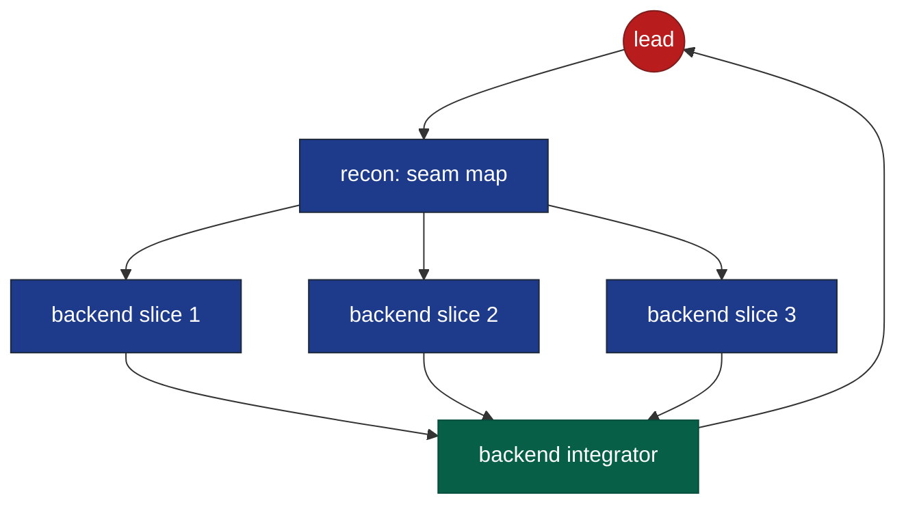
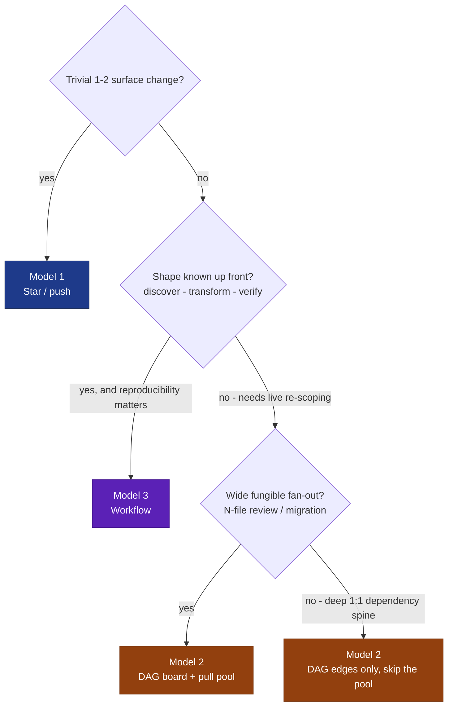

# Coordination models — comparison & selection guide

Compares the three coordination substrates for the team-process, across **determinism**,
**token economy**, and **performance** (plus topology and fit). Each model has its own file:

| # | Model | File |
|---|---|---|
| 1 | Star / push *(current)* | [`01-current-star-push.md`](01-current-star-push.md) |
| 2 | DAG board + event joins + pull pool *(proposed)* | [`02-proposed-hybrid.md`](02-proposed-hybrid.md) |
| 3 | Workflow substrate *(deterministic script)* | [`03-workflow-substrate.md`](03-workflow-substrate.md) |

**One-line each.**
- **1 — Star/push.** An LLM lead schedules + relays; phase order lives in its head.
- **2 — DAG board.** Order becomes data (`blockedBy`), joins become completion events, fan-out drains via a pull pool.
- **3 — Workflow.** A deterministic JS script is the coordinator; agents are one-shot leaves returning structured output.

## At-a-glance matrix

Ratings are relative across these three, for a **non-trivial multi-surface feature** (the case that
separates them; for a 1–2 file change model 1 wins on simplicity regardless).

| Dimension | 1 Star/push | 2 DAG board | 3 Workflow |
|---|---|---|---|
| **Determinism** | Low | Medium | **High** |
| **Token economy** (small work) | **Best** | Poor | Medium |
| **Token economy** (wide fan-out) | Poor | Medium | **Best** |
| **Performance / wall-clock** (fan-out) | Low | High | **Best** |
| **Adaptivity / live re-scope** | **High** | Medium | Low |
| Topology | star | star | star (leaves) |
| Shared state lives in | lead context | the board | JS variables |
| Coordinator | LLM lead | LLM lead + board | JS script |
| Setup cost | none | medium | medium (opt-in) |

## Determinism

- **1 — Low.** The lead re-decides scheduling every run; phases can be skipped or reordered, nothing enforces the DAG. Same input ≠ same orchestration.
- **2 — Medium.** `addBlockedBy` + claim-gating make the **order** deterministic and runtime-enforced, but *which* worker claims *when*, and the lead's event reactions, remain timing/LLM-dependent. Structure deterministic, execution not.
- **3 — High.** Control flow is code; same script + args ⇒ same phase structure, and runs are **journaled/resumable** (unchanged prefix replays from cache). Agent *content* is still stochastic, but the *orchestration* is reproducible.

## Token economy

- **1.** *Small work: best* — spawn-on-demand, nothing kept alive. *Wide work: poor* — every `RESULT` lands back in the **lead's context**, which bloats; hand-scheduling and re-reading state compound it.
- **2.** Offloads the schedule **off** the lead's context onto the board (good), but pays for **kept-alive pool workers**, **`TaskList` polling**, and **two-source reconciliation** (board `completed` vs real gate). Net: better than 1 on fan-out, worse than 1 on sparse/tiny work.
- **3.** *Wide structured work: best* — no persistent members, no board, no lead-relay bloat; **schema output is compact**; **budget-aware loops** scale depth to a token target. Cost leak: **one-shot agents re-derive context** each call (mitigate by passing structured payloads), plus occasional **schema-retry** overhead.

## Performance (wall-clock)

- **1 — Low on fan-out.** Joins are **blocking** `RESULT` waits; fan-out items are hand-scheduled and tend to serialize through the lead.
- **2 — High on fan-out.** **Event-driven joins** (`<task-notification>`) — no blocking; the **pool drains in parallel**; independent DAG branches overlap as soon as `blockedBy` clears. Overhead dominates on sparse/tiny work.
- **3 — Best on fan-out.** `pipeline()` removes **inter-stage barriers** (item A verifies while item B still builds); `parallel()` for true joins; concurrency capped at `min(16, cores-2)`. Wall-clock ≈ **slowest single-item chain**, not sum-of-stages.

## Consolidated pros / cons

**1 — Star / push**
- ✅ Simplest; cheapest for small work; proven; strong typed-form discipline.
- ❌ Order is code-in-head (skippable); lead context bloats; no load-balancing; blocking joins; low determinism.

**2 — DAG board + events + pull pool**
- ✅ Order is enforced data; event-driven joins; real pull for fan-out; leaner lead context.
- ❌ **No idle-worker wake** (missing primitive — board emits no events); two sources of truth; more machinery; pool idle cost; medium determinism.

**3 — Workflow substrate**
- ✅ Deterministic + replayable/resumable; no board to drift; best fan-out throughput + token efficiency; patterns (loop-until-dry, adversarial vote, budget scaling) in a few lines.
- ❌ No mid-run negotiation/re-scope; one-shot agents lack cross-task memory; branching must be anticipated in code; explicit opt-in + heavier.

## Intra-role parallelism (scatter → integrate)

When a single role's work is large and cleanly separable, the lead can split **below** the
one-task-per-specialist line: **N workers on disjoint slices + 1 integrator** merging them.
This **scatter → barrier → integrate** shape changes the ranking, because it converts a 1:1
typed lane into a **fungible worker pool** — the precise condition under which pull (2) and
fan-out (3) pay. (Same shape recurs one level up at the **cross-role** level; this is the
*intra*-role instance.)



| Shape | 1 Star/push | 2 DAG board | 3 Workflow |
|---|---|---|---|
| 1:1 typed lanes | fine | overkill | overkill |
| **Intra-role fan-out + integrate** | **worst fit** | good fit — `blockedBy` join + pull bucket | **best fit** — `parallel` barrier *is* the join |

- **Model 3** expresses it natively: `parallel(slices)` then an integrator `agent()`; the barrier **is** the join.
- **Model 2** models it as N slice tasks + an integration task `addBlockedBy` all of them — runtime-enforced join, real pull bucket.
- **Model 1** degrades — N parallel sub-workers + serial integration through a blocking star lead is its worst case.

**Bounded by three caveats:**
1. **Decomposition quality** — slices must be genuinely disjoint; a bad cut → merge conflicts. *(Addressed by Recon-first, below.)*
2. **Write isolation + merge cost** — parallel writers need git worktrees (~200–500ms + disk each); the integrator absorbs N contexts and merges them.
3. **Amdahl ceiling** — if integration is a ~30% serial fraction, max speedup ≈ `1/(0.3 + 0.7/N)` ≈ **1.9×** at N=3, not 3×. There is an **optimal N**; past it, overhead dominates.

## Recon-first decomposition

The fix for caveat #1. Before the implement phase, the lead spawns a **read-only scout**
(`Explore` agent) with **precise instructions**, receiving a **structured seam map** — not a
tour. Heavy code-reading stays in the scout's isolated context; only the concise map reaches
the lead, so it decomposes without ingesting the codebase.

**The report must be a partition map, not an explanation:**
- **clusters** — files/types that change together (candidate lanes)
- **cut-points** — where lanes sever with no shared writes
- **shared surface** — what every lane touches (= the integrator's scope + merge risk)
- **ordering deps** — any A-before-B that defeats parallelism

**Two dividends:**
1. **Enables the cut** — supplies disjoint slices (kills caveat #1).
2. **Go/no-go gate** — large shared surface / few seams = the signal *not* to parallelize (pre-empts caveat #3). One artifact yields the **lanes**, the **integrator brief**, the **fan-out width**, and the **parallelize-or-not** call.

**Data-driven fan-out (model 3) — width computed from the report:**
```js
const map = await agent(reconPrompt, { schema: COUPLING_MAP, agentType: 'Explore' })
const built = map.cleanSeams >= 2
  ? await parallel(map.lanes.map(l => () => agent(implPrompt(l), { schema: RESULT, isolation: 'worktree' })))
  : [await agent(implPrompt(map.whole), { schema: RESULT })]   // recon said: don't split
const integrated = await agent(integratePrompt(built.filter(Boolean), map.sharedSurface), { schema: RESULT })
```
In **model 2**, recon is a head task (`blockedBy` nothing); its map lets the lead lay out an
*accurate* `blockedBy` DAG instead of guessing edges.

**Irreducible residual:** recon is a **static** read — runtime coupling (DI, dynamic dispatch,
shared mutable state) can still surface at integration. It **lowers conflict probability; it
doesn't remove the join.** Keep the integrator + fix-loop as the net; treat the map as a
high-confidence prior, not a proof of disjointness.

**Generalizes:** scout → decompose → fan-out → integrate is the same shape at the **cross-role**
level (which surfaces are affected?) and the **intra-role** level (how to split one role?). One
recon primitive, two granularities.

## Selection guide



**Rules of thumb**
- **Default to 1.** Escalate only when fan-out or a deep DAG makes its cons bite.
- **Reach for 3** when the work has a **known shape** and you value **determinism / reproducibility** over conversational adaptivity (audits, migrations, multi-source review).
- **Reach for 2** when work is **open-ended** (needs a live lead to re-scope) **and** has **wide fungible fan-out** that benefits from a pull pool. For a deep 1:1 spine, take only 2's cheap half — `blockedBy` edges + event joins — and skip the pool.
- **Recon-first for any granular split.** Before splitting a role's work intra-role, run a read-only **seam-map scout** — it supplies the disjoint lanes *and* gates whether to split at all. Skip it and a blind cut risks merge conflicts that erase the parallelism gain.
- **They compose:** a model-1/2 conversational lead can invoke a **Workflow** for a single well-shaped phase (e.g. the review fan-out, or a recon-driven intra-role implement), then resume conversational control. Best of both is often a hybrid, not a pure choice.

## Caveat (verified)
Model 2's reactivity is bounded by a **runtime fact**: the task board emits **no change events**, so
an idle specialist cannot be woken by a posted task. Reactivity comes only from **agent-completion**
notifications (spawn-per-task) or **already-running** pool workers that pull. The fully-reactive
"agents watch the queue" design is **not buildable** — see [`02-proposed-hybrid.md`](02-proposed-hybrid.md).
