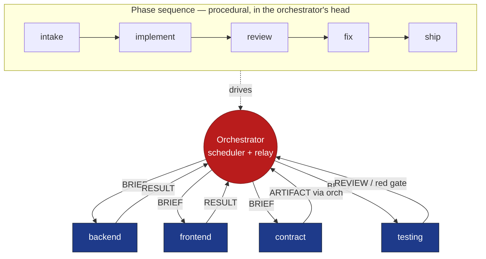

# Coordination model 1 — Current: star / push

**What ships today** in `.claude/team-process` (see `execution-modes.md`, `protocol.md`).

The orchestrator is both **scheduler and relay**. It hand-dispatches a `BRIEF` to each
role, collects each `RESULT`, and drives a **hardcoded phase sequence** held in its own
reasoning. Every cross-role message routes through the lead — the graph is a pure star.
Dependencies (contract→consumers, implement→review→test) exist only as procedural logic,
not as data. Members are woken by `SendMessage`; there is no shared state.

**Reads as:** every arrow touches the orchestrator. No peer edges. The phase DAG is invisible
to the runtime — only the lead knows the order.

## Pros
- **Simple + proven** — one coordinator, six typed forms, no extra state to keep consistent.
- **Cheap for small work** — spawn-on-demand; nothing kept alive idle.
- **Strong discipline** — `RESULT.gate` carries actual counts; reviewer ≠ implementer; in-lane only.

## Cons
- **Phase order is code, not data** — easy for the lead to skip/reorder a phase; nothing enforces it.
- **Orchestrator holds the whole schedule** — its context accumulates every role's state and the plan.
- **No load-balancing** — fan-out (N-file review/migration) is hand-scheduled item by item.
- **Blocking joins** — lead waits on `RESULT` messages rather than reacting to completion events.

## When this is the right model
- 1–2 surfaces, few tasks, each with exactly one forced owner.
- Short dependency chains where procedural ordering is trivial to keep correct.
- The default; escalate only when fan-out or deep DAGs make the cons bite.

See also: [`02-proposed-hybrid.md`](02-proposed-hybrid.md) · [`03-workflow-substrate.md`](03-workflow-substrate.md)
