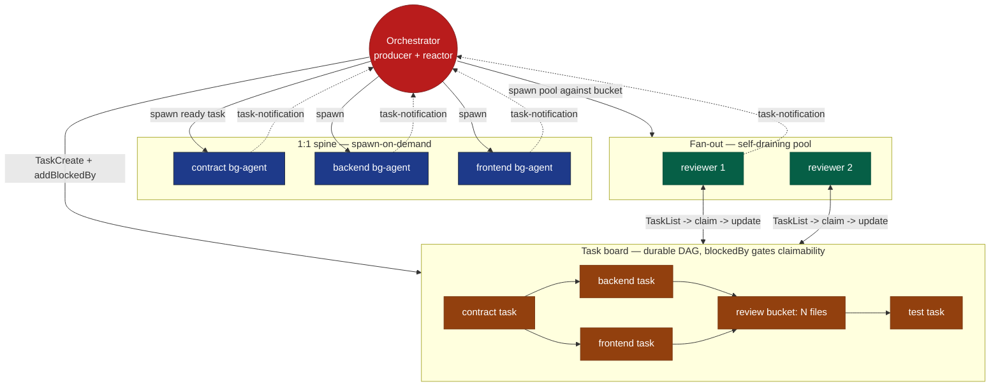

# Coordination model 2 — Proposed: DAG board + event joins + pull pool

**Grounded in verified runtime primitives** (task tools, `SendMessage`, `<task-notification>`).

The phase order becomes **data** — `TaskCreate` + `addBlockedBy` edges on the shared board,
with claim-gating enforced by the runtime (`blockedBy` tasks can't be claimed until deps
resolve). The 1:1 dependency spine spawns a **background agent per *ready* task** and the
orchestrator **reacts to its `<task-notification>` completion event** instead of running a
phase script. Fungible **fan-out buckets** are drained by a **self-pulling worker pool**.

> **Hard runtime limit baked into this design:** the task board emits **no change events**.
> A posted task cannot wake a sleeping specialist. So reactivity comes from *agent-completion*
> events (spawn-per-task) and from *already-running* pool workers that pull — **never** from
> idle workers watching a queue. Topology stays a star; only **scheduling** changes.

**Reads as:** solid edges = `blockedBy` (the DAG); dotted = completion events the lead reacts
to; the pool pulls from the board directly. The fan-out bucket is the one place true pull pays.

## What changed vs. model 1
| Aspect | Model 1 (current) | Model 2 (proposed) |
|---|---|---|
| Phase order | procedural, in lead | **data** — blockedBy, runtime-gated |
| Dispatch | push BRIEF per role | board task + spawn ready work |
| "Done" signal | RESULT via SendMessage | `<task-notification>` on completion |
| Fan-out | lead schedules each item | **pool self-drains** the bucket |
| Shared state | none | the board (DAG + owner/claim) |
| Topology | star | **still star** |

## Pros
- **Workflow is inspectable data** — DAG enforced; fewer "lead forgot a phase" bugs.
- **Event-driven joins** — react to completion, stop blocking/polling.
- **Real pull where it pays** — fan-out load-balances across a pool, no per-item scheduling.
- **Leaner lead context** — produce + react, not hold-the-whole-schedule.

## Cons
- **No idle-worker wake** — the fully-reactive "agents watch the queue" version is **not buildable**.
- **Two sources of truth** — board `completed` vs real gate counts; board can lie, still verify.
- **More machinery** — DAG setup, claim/owner discipline, pool lifecycle; overkill for tiny changes.
- **Pool idle cost** — workers kept alive to drain burn context when the bucket is sparse.

## Adoption path (incremental, not a rewrite)
1. **Cheap + safe everywhere:** encode the phase sequence as `addBlockedBy` edges and join on
   `<task-notification>`. Data-driven order, enforced gating — keep push spawn-on-demand.
2. **Add the pull pool only** for fungible fan-out slices (N-file review/migration, multi-surface
   implement). `/review-loop` already approximates this.
3. **Do not** build idle-specialist pull — no primitive powers it.

## Intra-role fan-out (scatter → integrate)

This model gains the most beyond the cross-role review bucket when a **single role's** work is
split granularly: N disjoint slice tasks + 1 integration task. The board expresses it natively —

- N slice tasks (fungible → a real **pull bucket** a backend-worker pool drains);
- one integration task with `addBlockedBy` on all N slices → the runtime **enforces the join**
  (the integrator can't claim until every slice completes);
- the lead reacts to the integration task unblocking via `<task-notification>`.

Precede it with a **recon head task** (`blockedBy` nothing): a read-only `Explore` scout returns
a **seam map** (clusters · cut-points · shared surface · ordering deps). Its `RESULT` lets the
lead lay out an **accurate** `blockedBy` DAG and size the pool to the discovered seams — instead
of guessing the edges. A large shared surface / few seams is the **go/no-go signal to not split**.
Slices write in isolated worktrees; the integrator merges them. Recon lowers conflict
probability but doesn't remove the join — keep the integrator + fix-loop as the net. Full
treatment: [`00-comparison.md`](00-comparison.md) *Intra-role parallelism* + *Recon-first*.

See also: [`01-current-star-push.md`](01-current-star-push.md) · [`03-workflow-substrate.md`](03-workflow-substrate.md)
