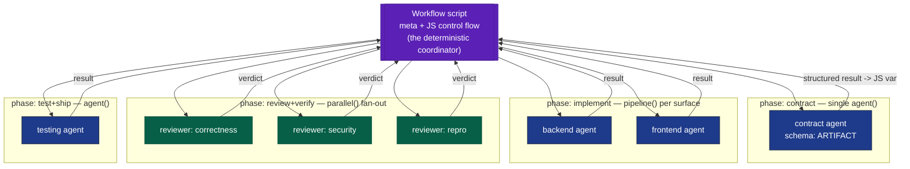

# Coordination model 3 — Workflow substrate (deterministic script)

**A third option:** run the process as a `Workflow` — a deterministic JavaScript script that
orchestrates **one-shot subagents** via `agent()` / `parallel()` / `pipeline()`. The **script
is the coordinator**: control flow (loops, branches, fan-out, joins) is code, not a conversing
lead and not a shared board. Agents are ephemeral, return **schema-validated structured output**,
and hold no state between calls — the script holds state in plain JS variables.

This is neither push-messaging nor a pull-board. It is **code-driven orchestration**: the phase
DAG is literal control flow; "reactivity" is `await` on promises; the join model is
`pipeline` (no barrier — items flow stage-to-stage independently) or `parallel` (barrier — wait
for all). Adversarial review = a fan of verifier agents voting on each finding.



**Reads as:** every agent is a leaf the script spawns and awaits; results flow back as typed
JS values. No agent talks to another; no agent persists. The "DAG" is the script's statements;
the fan-out/join is `pipeline`/`parallel`. The whole run is one deterministic program.

## Sketch (illustrative)
```js
export const meta = { name: 'feature-pipeline',
  description: 'contract -> implement -> adversarial review -> test',
  phases: [{title:'contract'},{title:'implement'},{title:'review'},{title:'test'}] }

phase('contract')
const artifact = await agent(contractPrompt, { schema: ARTIFACT })

phase('implement')                       // pipeline: each surface flows independently
const built = await pipeline(SURFACES,
  s => agent(implPrompt(s, artifact), { schema: RESULT, label: `impl:${s.role}` }),
  r => parallel(['correctness','security','repro'].map(lens => () =>   // verify as soon as built
        agent(verifyPrompt(r, lens), { schema: VERDICT, phase: 'review' })))
       .then(vs => ({ r, ok: vs.filter(Boolean).filter(v => v.real).length >= 2 })))

phase('test')
const confirmed = built.filter(Boolean).filter(x => x.ok)
const gate = await agent(testPrompt(confirmed), { schema: GATE })
return { artifact, confirmed, gate }
```

## Recon-driven intra-role fan-out (native idiom)

The **scatter → barrier → integrate** shape — split a role's work into N disjoint slices, build
in parallel, merge — is exactly `parallel()` + a follow-up `agent()`, and Workflow expresses it
best: the **barrier is the join**, the fan-out **width is computed from a recon report**, and a
no-split fallback is one branch.

```js
phase('recon')
const map = await agent(reconPrompt, { schema: COUPLING_MAP, agentType: 'Explore' })  // seam map, not a tour

phase('implement')
const built = map.cleanSeams >= 2
  ? await parallel(map.lanes.map(l => () =>
      agent(implPrompt(l), { schema: RESULT, isolation: 'worktree', label: `be:${l.id}` })))
  : [await agent(implPrompt(map.whole), { schema: RESULT })]        // recon said: don't split

const integrated = await agent(                                     // the barrier above IS the join
  integratePrompt(built.filter(Boolean), map.sharedSurface), { schema: RESULT })
```

- **Recon report** = `{ clusters, cutPoints, sharedSurface, orderingDeps, cleanSeams }` — supplies
  the lanes, the integrator scope (`sharedSurface`), the fan-out width, and the go/no-go gate.
- **Determinism bonus:** the decomposition is now **data**, so the run is replayable end-to-end.
- **Bounded by Amdahl** (serial integration fraction) and **worktree merge cost** — recon's
  `sharedSurface` quantifies both up front. Recon is a static read; keep the integrator as the net.
- Full treatment: [`00-comparison.md`](00-comparison.md) *Intra-role parallelism* + *Recon-first*.

## How it differs from models 1 & 2
| Aspect | 1 Star/push | 2 DAG board | 3 Workflow |
|---|---|---|---|
| Coordinator | lead (LLM) | lead + board | **JS script (deterministic)** |
| Control flow | lead reasoning | blockedBy + events | **code: loops/branches** |
| Agents | persistent-ish members | bg-agents + pool | **one-shot leaves** |
| State | in lead | on board | **JS variables** |
| Joins | RESULT messages | task-notification | **pipeline / parallel** |
| Determinism | low (model-driven) | medium | **high (replayable, resumable)** |
| Peer messaging | no | no | no |

## Pros
- **Deterministic + replayable** — same script + args ⇒ same structure; resume from journal cache.
- **No board to drift** — state is JS; structured output is schema-validated at the tool layer.
- **Best-in-class fan-out** — `pipeline` removes inter-stage barriers; `parallel` for true joins.
- **Cheap to scale patterns** — loop-until-dry, adversarial vote, budget-scaled fleets in a few lines.

## Cons
- **No mid-run human/agent negotiation** — agents can't ask the lead and adapt; the script is fixed.
- **One-shot agents = no cross-task memory** — re-deriving context each call (mitigate via schema payloads).
- **Plan-time rigidity** — branching must be anticipated in code; genuinely emergent re-planning is awkward.
- **Opt-in + heavier** — explicit user opt-in; can spawn many agents; not for trivial edits.

## When this is the right model
- Work with a **known shape**: discover → transform each → verify → synthesize.
- **Wide, fungible fan-out** with verification (review/audit/migration) — pipeline + adversarial vote.
- Runs you want **reproducible / resumable**, where determinism beats conversational adaptivity.
- **Not** for open-ended work needing live re-scoping — that favors model 1/2's conversational lead.

See also: [`01-current-star-push.md`](01-current-star-push.md) · [`02-proposed-hybrid.md`](02-proposed-hybrid.md)
