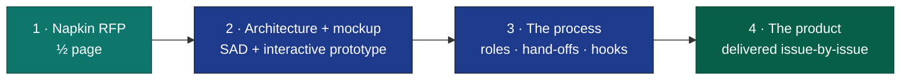
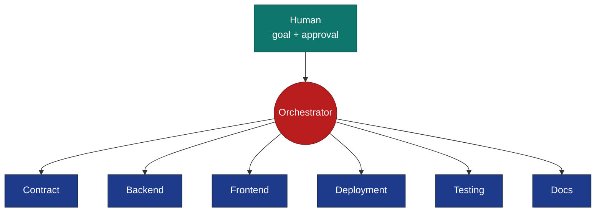
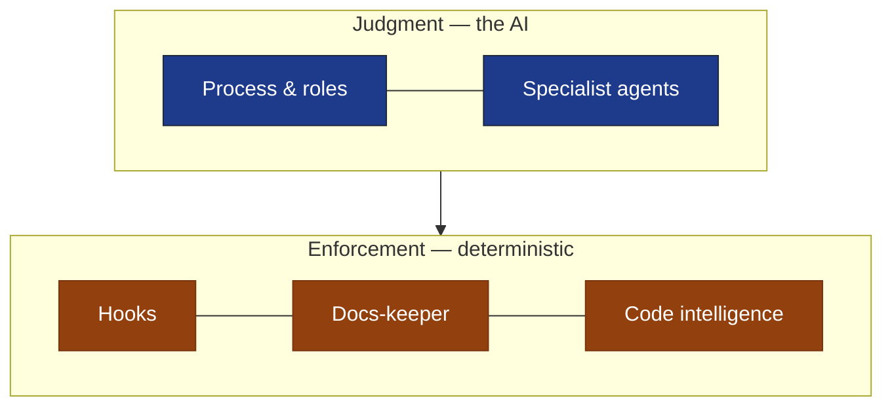

# Zero to Hero: A Shipping Product, Built by an AI Engineering Team

### From a napkin brief to a shipping product — a 5-minute read

> *Everyone agrees AI can write code. The real question is whether it can **ship a product** —
> design it, build it, test it, document it, deliver it. So one person tried: hand the entire job
> to a team of AI agents. **Three days later, a real deployment dashboard was running** — the one
> pictured below. Here's how, and why the result holds up.*

---

## ▶ In one slide

> **One person and AI built a shipping product. A half-page brief became a working MVP in
> 3 days — with the human only setting direction and signing off.**

- **Goal** — a real product — the **Deployment Dashboard** — *produced* by AI: code, automation, docs, tests, delivery.
- **How** — one orchestrator routes work to specialist AI agents, like a senior human team.
- **Trust** — every critical rule is enforced by a deterministic hook the AI *can't* bypass.
- **Proof** — **MVP in 3 days**; a full feature in **~2.5 hours**; the system holds **~1,700 tests**.

`1 human · MVP in 3 days · 6 roles · 14 process commands · 10 enforced hooks · 6 hand-off forms · ~1,700 tests`

---

## A real, running product

*This is the product the AI team built: the **Deployment Dashboard** — a live services × environments
matrix, sourced straight from CI/CD pipeline events. Not a prototype, not a slide.*

**Explore it:** [adopter documentation](https://kostiantyn-matsebora.github.io/deployment-dashboard/) ·
[how it was built](https://kostiantyn-matsebora.github.io/deployment-dashboard/built-by-ai/) ·
[source on GitHub](https://github.com/kostiantyn-matsebora/deployment-dashboard)

---

## Two achievements in one project

1. **A method — an AI engineering team.** A reusable process: specialist roles, AI agents, and enforced guardrails.
2. **A product — built entirely by it.** A real deployment dashboard, shipped end-to-end with one human steering.

**The method is the reusable asset; the product is the proof it works.**

---

## The goal

**A real product — the Deployment Dashboard — *produced* by AI, not just code *written* by AI.**

Most "AI coding" stops at snippets a human must then integrate, test, document, and ship.
The goal here: AI owns the **whole lifecycle** of a real product, human stays minimal.

| Lifecycle stage | Owned by AI |
|---|---|
| **Source code** | backend, web app, browser extension |
| **SDLC automation** | branching, guardrails, CI/CD, release machinery |
| **Documentation** | architecture, specs, guides — kept current |
| **Testing** | unit, contract, integration, end-to-end |
| **Delivery** | committed & reviewed as PRs — then cut as GitHub Releases with deployable Docker images |

→ Human owns only **direction** and **acceptance**. Everything between is the AI team's.

---

## Zero to hero

**The hero is the shipping product — and the method built to produce it.** The arc: an idea on
half a page → a tested, documented, shipping system.

- **1 · Napkin brief** — half a page: what it should do, and the constraints.
- **2 · Architecture & design** — AI wrote the full architecture doc + interactive mockup *first*.
- **3 · The process itself** — AI built the *team* that builds the product. **This is the reusable asset.**
- **4 · The product** — delivered as plain-language requirements and issues. **Output of the process, not a one-off.**

→ **Idea to working MVP: 3 days — built by one person and an AI team.**

---

## Why a process — not just a model

**The hard part isn't writing code. It's coordination — and trust.**

- One feature spans contract, backend, frontend, tests, deployment, docs — six specialties.
- A single AI doing it all loses the thread and skips steps.
- So we gave the AI the **operating model of a disciplined team.**

---

## How it works: judgment + enforcement

**Layer 1 — Instructions (the judgment).** An orchestrator routes each piece to the specialist that owns it.

**Layer 2 — Hooks (the guarantees).** Instructions can be forgotten under pressure. Hooks can't.
They run automatically and **mechanically block** any rule-break — the AI can't talk past them.

| The rule | Enforced automatically by a hook |
|---|---|
| **Stay in your lane** | edits to unassigned files are blocked |
| **Lead doesn't code** | the orchestrator can't edit product files |
| **Disciplined hand-offs** | malformed reports are rejected unread |
| **Workers never commit** | only the integrator can commit / ship |
| **Docs never go stale** | a commit that desyncs docs is blocked |
| **Never ship red** | one failing test blocks the merge |

*Ten such hooks — each independently tested, wired in at every key moment.*

---

## What the solution is made of

**Five building blocks — instructions on top, automatic enforcement underneath.**

| Block | What it is |
|---|---|
| **Process & roles** | a defined lifecycle — intake → contract → build → review → test → ship — run by an orchestrator + 6 specialist roles |
| **Specialist agents** | the workers: AI agents for API, backend, frontend, deployment, testing, documentation |
| **Docs-keeper** | keeps documentation authoritative and current — and blocks any change that lets it drift |
| **Hooks** | 10 deterministic guards that enforce the rules automatically, every time |
| **Code intelligence** | purpose-built search so agents navigate the codebase fast and cheaply |

---

## The process in action: issue #299

**A DORA analytics view — contract to shipped — in ~2.5 hours.**

- **~6,500 lines, 41 files** — API contract, backend, web UI, spec, tests.
- **Self-corrected** mid-flight via the review-and-fix loop.
- **Stopped at the pull request** for human acceptance — it never auto-merges.

→ **See the real thing:** [issue #299 — the requirements](https://github.com/kostiantyn-matsebora/deployment-dashboard/issues/299) ·
[PR #308 — the implementation](https://github.com/kostiantyn-matsebora/deployment-dashboard/pull/308)

---

## What the team has built

- **Backend** — fetches & aggregates deployment data from CI/CD providers
- **Web dashboard** (Angular) — live status, history, analytics
- **Browser extension** — at-a-glance deployment health
- **Demo environment** — whole stack runs locally with one command
- **Gateway + container stack** — for local and CI runs
- **~1,700 automated tests** + **always-current documentation**

---

## Why it matters

| For the business | What it delivers |
|---|---|
| **Team** | one person directing an AI engineering team |
| **Time to market** | working MVP in **3 days**; features in hours |
| **Speed** | full feature, goal → tested PR, in hours |
| **Quality** | tests & review enforced by hooks — can't be skipped |
| **Consistency** | every change follows the same process |
| **Living docs** | documentation can't silently rot |
| **Reusability** | the process builds the *next* product too |
| **Control** | humans set direction; AI executes within guardrails |

---

## Where it goes next

- **Today** — one coordinated session per feature.
- **Next** — parallel specialists per role + deterministic, replayable build pipelines.

*Technical detail: [`00-comparison.md`](00-comparison.md).*

---

> **The takeaway.** One person and AI built a shipping product — a half-page idea became a
> working **MVP in 3 days**, plus a reusable engineering process that builds the next product too.
> The breakthrough isn't a smarter model. It's **instructions for judgment + hooks for guarantees.**
