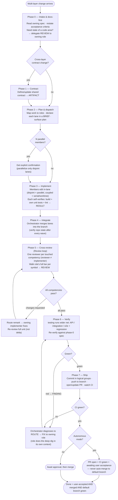

# Orchestration Process — Activity Diagram

Activity-flow view of [`process.md`](process.md): the **Phases (0–7)** plus the embedded
**Review loop** (Phase 5) and **Fix loop** (Phases 6–7), ending at the autonomy/merge gate.

## Modeling notes

- **Phase 1 is gated** — the contract phase runs only for cross-layer changes; single-lane work skips to planning.
- **Two feedback loops** — the *Review loop* (Phase 5 → fix → re-review until all `pass`) and the *Fix loop* (Phase 6/7 red → `FIX` → re-verify until green).
- **The merge gate is outside Ship** — autonomous mode stops at "PR open + CI green"; only user acceptance + merge reaches *Done*.
