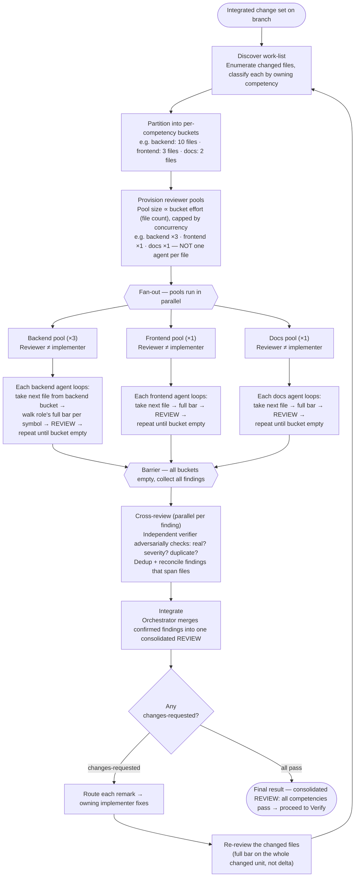

# Review Workflow — Activity Diagram

Visual companion to [`/review-loop`](../commands/review-loop.md); pairs with [`process-activity.md`](process-activity.md). Depicts: partition changed files into per-competency buckets → provision reviewer pool ∝ effort (file count) → drain bucket one file at a time → cross-review (adversarially verify + dedup) → integrate into one consolidated `REVIEW`.

## Modeling notes

- **Pools, not one-agent-per-file.** Files are bucketed by owning competency; pool size ∝ effort (file count), capped by concurrency (e.g. 10 backend + 3 frontend → ~3 back : 1 front, not 13 agents).
- **Work-queue drain.** Each agent takes the next file from its bucket, reviews it (full bar per symbol → `REVIEW`), and repeats until the bucket is empty — so "one reviewer per file" holds *at a time*, with a bounded, balanced worker pool.
- **Reviewer ≠ implementer.** Within a competency, reviewers are independent of that lane's implementers.
- **Barrier before cross-review.** All findings are collected once every bucket is drained, because cross-review needs the full set to dedup and reconcile findings spanning multiple files.
- **Cross-review = adversarial verify + dedup.** Each finding is independently challenged ("real? right severity?") and cross-file duplicates merged — the cross-check a single-pass per-file review can't do.
- **Integrate → one REVIEW.** The orchestrator synthesizes survivors into a single consolidated result; after fixes the loop re-discovers + re-reviews the *whole* changed unit, not just the original remark.
