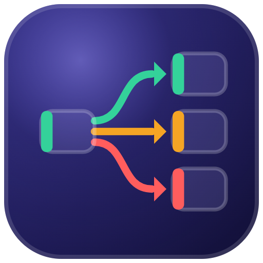
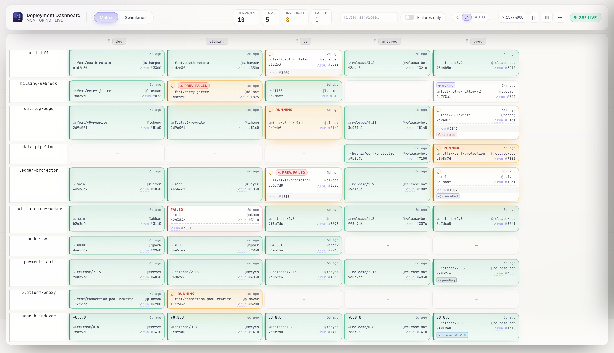
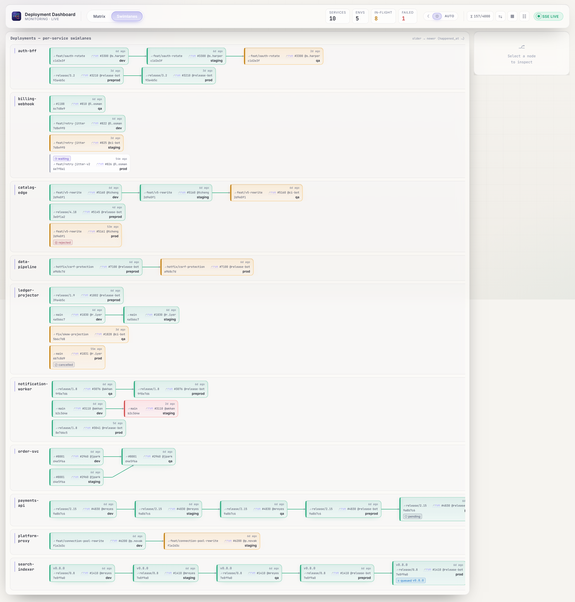
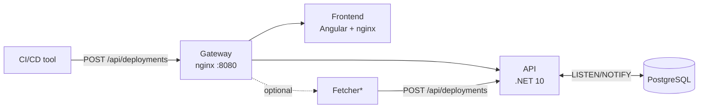

<p align="center">
  
</p>

<h1 align="center">Deployment Dashboard</h1>

<p align="center">
  A real-time <strong>services × environments</strong> deployment matrix, sourced straight from your CI/CD pipeline events.
</p>

<p align="center">
  <a href="https://github.com/kostiantyn-matsebora/deployment-dashboard/blob/main/LICENSE"></a>
  <a href="https://github.com/kostiantyn-matsebora/deployment-dashboard/releases"></a>
  <a href="https://kostiantyn-matsebora.github.io/deployment-dashboard/"></a>
</p>

<p align="center">
  <a href="docs/guide/quickstart.md"><strong>Quickstart</strong></a> ·
  <a href="docs/guide/send-events.md"><strong>Integrate your CI/CD</strong></a> ·
  <a href="https://kostiantyn-matsebora.github.io/deployment-dashboard/"><strong>Docs</strong></a>
</p>

---

<picture>
  <source media="(prefers-color-scheme: dark)" srcset="docs/_assets/screenshots/matrix-dark.png">
  
</picture>

> **The question it answers:** *What version of service X is running in environment Y right now — and did the last deployment succeed?*

## Why Deployment Dashboard?

- **Single-step integration.** One `POST /api/deployments` call — no plugins, no agent, no pipeline rewrite.
- **Tool-agnostic.** GitHub Actions, Azure DevOps, GitLab CI, Jenkins, shell scripts — anything that can call a URL.
- **One screen, instant answer.** Every service across every environment; no clicking through pipelines and logs.
- **Live via SSE.** State changes push to every open browser within seconds — no refresh, no stale tab.
- **Full append-only history.** Every deployment kept per slot (≥ 90 days, configurable); nothing overwritten.
- **Auto-discovers topology.** Services and environments are derived from events you send — no registration, no config file.
- **Secure by design.** Writes are API-key gated; reads are internal-only; the SPA holds no secrets.
- **Pull mode when you can't push.** The optional Fetcher polls your CI/CD API and posts through the same contract.

## Try it in 2 minutes

Zero config — no API keys, no database setup, no clone required.

```bash
docker compose --project-directory . -f oci://ghcr.io/kostiantyn-matsebora/deployment-dashboard-compose-demo:latest --profile demo up
```

Then open:

| URL | What you get |
|---|---|
| <http://localhost:8080> | Live deployment matrix |
| <http://localhost:8080/demo/> | Demo Driver control panel |

Prefer explicit local files? See the [Quickstart](docs/guide/quickstart.md) for the `curl` alternative.

## Send your first deployment

One HTTP call from your pipeline — that's the whole integration:

```bash
curl -X POST "$DASHBOARD_URL/api/deployments" \
  -H "X-Api-Key: $DASHBOARD_API_KEY" \
  -H "Content-Type: application/json" \
  -d '{
    "deployment_id": "build-42",
    "service":       "checkout",
    "environment":   "prod",
    "version":       "1.4.2",
    "status":        "success",
    "happened_at":   "2026-06-01T10:00:00Z"
  }'
```

[GitHub Actions, Azure DevOps, GitLab & Jenkins examples →](docs/guide/send-events.md)

## Two views

- **Matrix** — one row per service, one column per environment; each tile shows version, status, actor, elapsed time, and a CI/CD run link.
- **Swimlanes** — per-service deployment graphs showing how a version flows from `dev` through to `prod`, with branching topology and status-colored edges.

<picture>
  <source media="(prefers-color-scheme: dark)" srcset="docs/_assets/screenshots/swimlanes-dark.png">
  
</picture>

## Deploy for your team

Fetch the env template, fill in your secrets, then start the stack from the OCI artifact — no clone required:

```bash
curl -fsSLO https://raw.githubusercontent.com/kostiantyn-matsebora/deployment-dashboard/main/compose/.env.example
cp .env.example .env
# edit .env — set API_KEY, POSTGRES_USER, POSTGRES_PASSWORD (+ POSTGRES_HOST for standalone)

docker compose --project-directory . -f oci://ghcr.io/kostiantyn-matsebora/deployment-dashboard-compose:0.1.0 --profile full up -d
```

**Shapes:** `standalone` (external PostgreSQL) or `full` (bundled PostgreSQL); add `-pull` to either for the optional Fetcher. `demo` is for evaluation only. The gateway (`:8080`) is the only published port. Pin a version via `DASHBOARD_VERSION=0.1.0` in `.env` (no leading `v`).

[Install & deploy →](docs/guide/install.md)

## How it works



`*` Dashboard.Fetcher is the optional pull-mode adapter — polls a CI/CD API and posts events through the same push endpoint.

[Architecture overview →](docs/guide/architecture-overview.md)

## Documentation

**Site:** <https://kostiantyn-matsebora.github.io/deployment-dashboard/>

- [Quickstart](docs/guide/quickstart.md) — run the demo locally in 2 minutes.
- [Install & deploy](docs/guide/install.md) — Compose profiles, production checklist.
- [Configuration](docs/guide/configuration.md) — every environment variable.
- [Integrate your CI/CD](docs/guide/send-events.md) — pipeline examples.
- [Architecture overview](docs/guide/architecture-overview.md) — how the pieces fit.
- [FAQ & troubleshooting](docs/guide/faq.md)

## Contributing · License · Security

- **Contributing:** local setup, branch → PR workflow, and project layout are in [CONTRIBUTING.md](CONTRIBUTING.md).
- **License:** MIT — see [LICENSE](LICENSE).
- **Security:** follow the [Security policy](SECURITY.md) for vulnerability reports.
