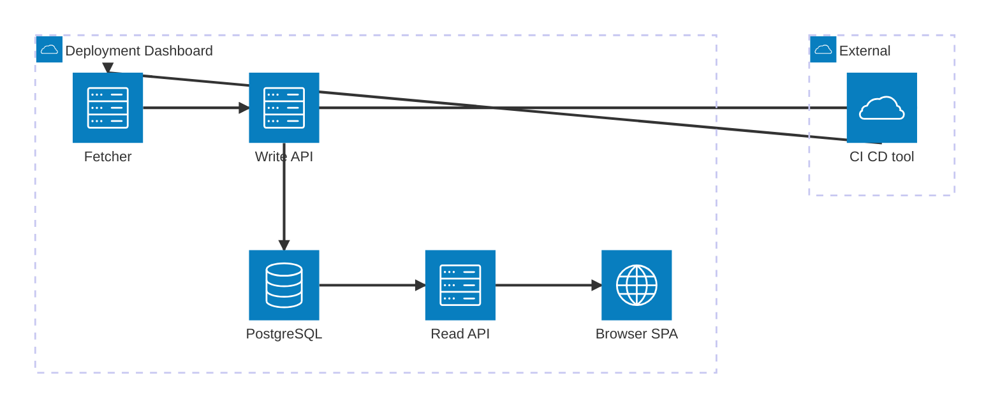

<!-- TODO: drop a screenshot of the dashboard here (capture from docs/ui/deployment-dashboard.html) -->

<h1 align="center">Deployment Dashboard</h1>

<p align="center">
  Real-time services x environments deployment matrix from any CI/CD tool.
</p>

<p align="center">
  <a href="https://kostiantyn-matsebora.github.io/ginee/"></a>
  <a href="https://github.com/kostiantyn-matsebora/ginee"></a>
  <a href="LICENSE"></a>
  
</p>

> [!NOTE]
> Every line of this repo — code, ADRs, CRs, tests, CI — was authored by AI specialists routed through the [`ginee`](https://github.com/kostiantyn-matsebora/ginee) multi-agent framework.

One screen, every service, every environment, every deployment — live. Built for engineers and teams running multi-service deployments who want a single glance answer to *"what version of service X is running in environment Y right now, and did the last deploy succeed?"* Tool-agnostic by design: any CI/CD tool that can POST an HTTP event can feed the matrix. Read-only / notification-only — it tracks deployments, it never triggers them.

**[Read the docs &rarr;](https://kostiantyn-matsebora.github.io/deployment-dashboard/)**

---

## Quickstart (60-second demo)

A clean machine with Docker + the GitHub CLI (`gh`) installed can be running the dashboard in three lines. Demo mode requires no PAT, no config — it boots the optional fetcher against public repos in GitHub's anonymous-mode rate bucket.

```powershell
# Windows (PowerShell 7+)
gh release download --repo kostiantyn-matsebora/deployment-dashboard --pattern install.ps1 --output install.ps1 --clobber
pwsh -NoProfile -File install.ps1 -Demo
# Open http://localhost:8080
```

```bash
# Linux / macOS
gh release download --repo kostiantyn-matsebora/deployment-dashboard --pattern install.sh --output install.sh --clobber
bash install.sh --demo
# Open http://localhost:8080
```

Need a real install (your own CI/CD events, custom port, pinned version)? See **[install docs](docs/install.md)**.

---

## Features

- **Tool-agnostic** — any CI/CD tool that can POST HTTP (GitHub Actions, Azure DevOps, Jenkins, GitLab CI, ...).
- **Real-time** — SSE + Postgres `LISTEN/NOTIFY`, deployment events on screen in ≤ 5 s.
- **Read-only / notification-only** — never triggers or manages deployments.
- **Six box states** — success / failure / in-flight / pending / unknown / stale, single-glance status.
- **Four views x three layouts** — Detailed / Compact / Glance / Focus across Matrix / Swim-lane / Workflow-rows.
- **Theme** — light / dark / auto (system-preference).
- **Optional pull-mode fetcher** — for tools without webhook support (GitHub Actions today, extensible).
- **Internal-only posture** — no public ingress required, no RBAC, X-Api-Key on writes only.

---

## How it works



| Edge | Meaning |
|---|---|
| `CI/CD tool → Write API` | Pipeline step POSTs `/api/deployments` (push path) |
| `CI/CD tool → Fetcher` | Fetcher polls the CI/CD tool's API (pull path; optional worker) |
| `Fetcher → Write API` | Fetcher POSTs `/api/deployments` for each polled deployment |
| `Write API → PostgreSQL` | Insert deployment row + Postgres `NOTIFY` |
| `PostgreSQL → Read API` | `LISTEN` for change events + query history |
| `Read API → Browser SPA` | Server-Sent Events (SSE) stream |

The backend never talks to a CI/CD tool directly. Integrators add a one-line POST to a pipeline step (or run the optional fetcher worker for pull-mode sources). Database NOTIFY drives an SSE stream that the SPA consumes — no polling on the wire.

Full topology + decisions: [`docs/architecture.md`](docs/architecture.md).

---

> [!WARNING]
> **Pre-1.0** — APIs, infra, and configuration may change. Suitable for evaluation, demos, and internal testbed use only.

---

[Documentation](https://kostiantyn-matsebora.github.io/deployment-dashboard/) · [Install](docs/install.md) · [Contributing](CONTRIBUTING.md) · [Code of Conduct](CODE_OF_CONDUCT.md) · [Security](SECURITY.md) · [Changelog](CHANGELOG.md) · [License](LICENSE)
