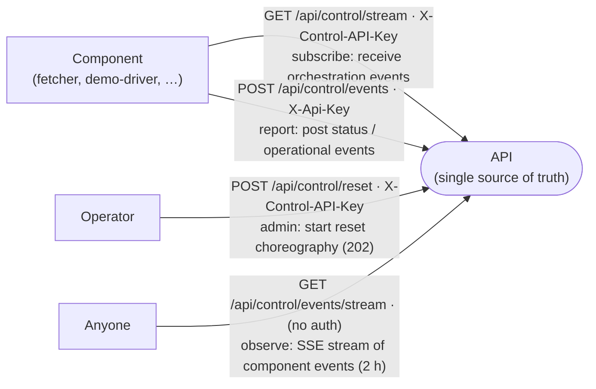

# API Guidelines

Companion to [`openapi.yaml`](./openapi.yaml). Binding for every implementer of `Dashboard.Api`, `Dashboard.Fetcher`, and the Angular SPA.

---

## 1. Naming

| Surface | Convention | Example |
|---|---|---|
| URI path segments | lower kebab-case, plural nouns | `/api/deployments`, `/api/fetcher/state` |
| Path params | lower kebab-case | `{adapter}` |
| Query params | lower snake_case | `?since=…&run_number=…` |
| JSON fields | lower snake_case | `deployment_id`, `parent_deployments`, `happened_at` |
| Enum values | lower kebab-case | `pending`, `queued`, `waiting`, `in-progress`, `success`, `failure`, `cancelled`, `rejected` |
| Headers | `Train-Case` | `X-Api-Key`, `X-Component-Id`, `Last-Event-ID` |

**Verb mapping.**
- Side-effecting writes → `POST` (append-only ingest) or `PUT` (idempotent upsert, fetcher cursor).
- Named destructive actions on the control surface → `POST` (e.g. `reset`).
- Reads → `GET`. No `PATCH`.
- No `DELETE` on the public API — retention is owned by the backend background job per SAD §11 Retention.

---

## 2. Required headers

| Header | Direction | When | Value |
|---|---|---|---|
| `X-Api-Key` | request | every write call (`POST /api/deployments`, `GET/PUT /api/fetcher/state/*`, `POST /api/control/events`) | Static shared secret. |
| `X-Control-API-Key` | request | control stream + reset (`POST /api/control/reset`, `GET /api/control/stream`) | Static shared secret, distinct from `X-Api-Key` (D8). |
| `X-Component-Id` | request | **required** on `POST /api/control/events` | Component identifier. Pattern: `^[a-z0-9][a-z0-9.-]{0,127}$`. Stored as `component_id` on the row. |
| `X-Correlation-Id` | request | **optional** on `POST /api/control/events` | Opaque correlation token, ≤ 128 chars. Stored as nullable `correlation_id` on the row; echoed on the component-events SSE frame. For reset, set to the `reset-initiated` event id. Absent → `null`; length 1–128 → accepted; > 128 → `422`. |
| `X-Progress-Reporter` | request | optional on `POST /api/deployments` | Ingest attribution. Format: `<emitter>/<adapter>`. Stored alongside the deployment event row. |
| `Content-Type` | request | every body-bearing call | `application/json; charset=utf-8` |
| `Accept` | request | optional | `application/json`, or `text/event-stream` for SSE endpoints. |
| `Last-Event-ID` | request | SSE reconnect (deployment stream, control stream, **and** component-events stream) | Last seen event id; server replays everything strictly greater within retention window. |
| `Retry-After` | response | `429`, `503` | Integer seconds. |
| `ETag` / `If-None-Match` | both | `GET /api/matrix`, `GET /api/analytics/*` | Weak ETag; SPA SHOULD send `If-None-Match` to short-circuit unchanged reads (`304`). |

---

## 3. Versioning

- **Single live version.** No `/v1` segment — internal-only tooling (NFR-04), one tenant, one consumer.
- **Evolution is additive only.** New optional fields, new endpoints, new enum values appended at the tail.
- **Breaking change ⇒ new path prefix.** A v2 surface lives at `/api/v2/...` side-by-side with `/api/...` until the SPA + notify step + fetcher are all migrated.
- **Write bodies are closed.**
  - `openapi.yaml` sets `additionalProperties: false` on ingest + fetcher-upsert bodies.
  - Unknown fields on write → `422` (not silently ignored).
  - Forward-compat: additive evolution (new optional fields only); never lenient parsing.
- **Read responses are open.** Clients MUST ignore unknown JSON fields (forward-compat with newer servers).

---

## 4. Authentication

| Surface | Auth | Rationale |
|---|---|---|
| `POST /api/deployments` | `X-Api-Key` | FR-10 — every write rejected with `401` on missing/invalid key. |
| `GET/PUT /api/fetcher/state/{adapter}` | `X-Api-Key` | Mutates persistent state; same trust tier as ingest. |
| `POST /api/control/events` | `X-Api-Key` | Components share the existing ingest key — no additional credential needed. |
| `POST /api/control/reset` | `X-Control-API-Key` | Destructive operation (D8); ingest key grants no control access. |
| `GET /api/control/stream` | `X-Control-API-Key` | Control stream is for trusted internal components; separates subscription privilege from ingest. |
| `GET /api/control/events/stream` | none | Same as other reads / browser EventSource; observability. |
| `GET /api/matrix`, `GET /api/deployments`, `GET /api/services`, `GET /api/environments` | none | Internal-only network (NFR-04); SPA never holds a secret. |
| `GET /api/analytics/*` | none | Aggregate reads; same trust tier as the other reads. |
| `GET /api/events/stream` | none | Same as other reads; auth would defeat browser EventSource. |
| `GET /healthz`, `GET /readyz` | none | Probe surfaces. |

The dev/local fake key is configured in the API container's environment and is **never** embedded in the SPA bundle.

---

## 5. Pagination, filtering, sorting

- **Cursor pagination only.** Endpoints that paginate accept `cursor` + `limit`; response carries `next_cursor` (nullable).
- **No `offset` / `page`.**
- **Cursors are opaque** base64 blobs — clients MUST NOT parse them.
- **Default `limit` = 100, max = 500.** Out-of-range → `422`.
- **Default sort** for `GET /api/deployments` is `happened_at DESC` then `id DESC` as a tiebreaker (stable for cursor resume).
- **Filtering** is via flat query params. No JSON filter DSL.
- `since` / `until` are RFC 3339 UTC timestamps; the server treats `[since, until)`.

---

## 6. Error envelope (RFC 9457)

Every non-2xx body is `application/problem+json`:

```json
{
  "type":     "https://deployment-dashboard/errors/validation",
  "title":    "Payload validation failed",
  "status":   422,
  "detail":   "status must be one of pending|queued|waiting|in-progress|success|failure|cancelled|rejected",
  "instance": "/api/deployments"
}
```

For `422` payload-validation failures, the body additionally carries an `errors[]` array of JSON-Pointer / message pairs:

```json
{
  "type":   "https://deployment-dashboard/errors/validation",
  "title":  "Payload validation failed",
  "status": 422,
  "errors": [
    { "pointer": "/happened_at", "message": "must be RFC 3339 with timezone" },
    { "pointer": "/run_number",  "message": "must be an integer" },
    { "pointer": "/status",      "message": "must be one of pending|queued|waiting|in-progress|success|failure|cancelled|rejected" }
  ]
}
```

### Status-code matrix (binding for the write surface)

| Status | Trigger |
|---|---|
| `201 Created` | Event appended. `Location` header carries `/api/deployments/{id}`. |
| `204 No Content` | Stored / recorded (fetcher state, component event, control reset). |
| `401 Unauthorized` | API key (`X-Api-Key` or `X-Control-API-Key`) missing or invalid. |
| `413 Payload Too Large` | Fetcher cursor or component event payload over 8 KiB. |
| `422 Unprocessable Entity` | Schema-level validation failed; or missing/invalid `X-Component-Id` on `POST /api/control/events`. |
| `429 Too Many Requests` | Future rate-limit slot. `Retry-After` always present. |
| `503 Service Unavailable` | DB unreachable; any LISTEN channel not attached (`deployment_events`, `control_events`, `component_acks`, `component_events`). |

**No `409 Conflict` on ingest.** The store is append-only — duplicates are not a server-side concern.

---

## 7. Real-time stream — deployment events (SSE)

- Endpoint: `GET /api/events/stream`.
- Media type: `text/event-stream`.
- Event names: **`deployment`** (only).
- Each `data:` line carries one full `DeploymentEvent` JSON object — clients merge into local state by `(service, environment)` for the Matrix and by `id` for Swimlanes.
- `id:` is monotonic per-event; clients reconnect with `Last-Event-ID`.
- Server emits `: ping` comment every 15 s for proxy keepalive.
- Backed by PostgreSQL `LISTEN/NOTIFY` on the `deployment_events` channel — each API instance broadcasts only to its own connected clients (NFR-05).

---

## 8. Append-only semantics

- `POST /api/deployments` **appends** a row. There is no update, no upsert, no dedup.
- A retried POST produces an **additional** row. Handling retries is the caller's concern.
- `deployment_id` is an **emitter-supplied correlation key** grouping multiple event rows. NOT a row identity, NOT a uniqueness constraint, NOT an idempotency key.
- `happened_at` is **emitter-supplied** and required (UTC wall-clock on the CI/CD side).
- The read surface reduces the log:
  - **Matrix** — `MAX(happened_at)` per `(service, environment)` for `current`; success-filtered for `last_successful`.
  - **Swimlanes** — client groups rows by `deployment_id`.
  - **History drawer** — every row preserved, newest-first.
- `PUT /api/fetcher/state/{adapter}` is the **one** non-append surface in the deployment domain — idempotent upsert of a cursor row.

---

## 9. Rate limiting

MVP does not enforce rate limits — internal-only network, single SPA, predictable CI/CD push rate. The contract reserves:

- `429 Too Many Requests` + `Retry-After` for the ingest path.
- `X-RateLimit-Limit` / `X-RateLimit-Remaining` / `X-RateLimit-Reset` for a future budget-based limiter.
- Implementers SHOULD NOT add these headers until a real limit is in force.

---

## 10. Security notes

- **Internal-only.** The API has no public ingress; only the App Gateway is reachable (NFR-04).
- **No CORS config.** Single origin via the gateway eliminates CORS surface entirely.
- **No PII.** `actor` is a CI/CD identifier (login / service principal), not an end user.
- **No secret echo.** `X-Api-Key` and `X-Control-API-Key` MUST NOT appear in any response body, problem detail, or log line.
- **Opaque cursors.** Fetcher cursors and component event payloads are stored verbatim; the server MUST NOT parse, log (beyond acknowledgement), or inspect them.

---

## 11. Control plane — Kubernetes-style orchestration

### Communication model

The API is the **single source of truth** for system state. Components (fetcher, demo-driver, …) always initiate calls to the API — the API never initiates calls to components.



Every arrow originates at the caller. The SSE stream is a **response to a component-initiated GET** — the API emits into it, but the connection is inbound.

### SSE control stream (`GET /api/control/stream`)

| Property | Value |
|---|---|
| Auth | `X-Control-API-Key` (header required) |
| Client type | Backend service components only — NOT browser clients |
| HTTP client | Components MUST use `fetch()` + `ReadableStream`; browser `EventSource` cannot send custom headers |
| Event names | `reset-initiated` \| `reset-started` \| `reset-completed` (reset choreography); forward-compatible — unknown types are no-ops |
| **`Last-Event-ID` replay** | Supported; backed by `control_stream_events` table (2 h retention) |
| Heartbeat | `: ping` comment every 15 s |
| Filter | `?component=<id>` — server delivers only events where `component` equals the id or `"*"` |
| Fan-out | PostgreSQL `NOTIFY control_events` channel; consistent across API instances (NFR-05) |

**`Last-Event-ID` replay behaviour** mirrors the deployment stream:
- On reconnect, component sends `Last-Event-ID: <last-seen-uuid>`.
- Server replays `WHERE id > @last ORDER BY id` from `control_stream_events`, then attaches to live channel.
- Events older than 2 h are purged; replay is bounded to the retention window.

**Current event types — reset choreography** (see [`reset-choreography.md`](../diagrams/reset-choreography.md)):

| `type` | When emitted | Scope | Component action |
|---|---|---|---|
| `reset-initiated` | `POST /api/control/reset` accepted (`idle → draining`) | `*` | Drain: stop work, block own surfaces, then ack (`reset-ack` / `paused` / `X-Correlation-Id`). |
| `reset-started` | All acks in OR `AckTimeoutSeconds` elapsed (`draining → resetting`) | `*` | Reset window open; ingest briefly returns `503`. |
| `reset-completed` | Data cleared, gates released (`resetting → idle`) | `*` | Recover: clear state, re-ingest/backfill, report `running`. |

**`correlation_id` — the process id (binding).** Every frame carries `correlation_id`:
- `reset-initiated` — equals the frame's own `id` (the process id originates here).
- `reset-started` / `reset-completed` — the initiating `reset-initiated` id.

Each frame's `id` (SSE cursor) is its own unique value, **distinct** from `correlation_id`; the two coincide only at the origin. The component side carries the same `correlation_id` on `reset-ack` + post-reset `status`, so the whole saga shares one filterable key. There is no `reset_id` field anywhere.
Components MUST ignore unknown `type` values (forward-compatibility).

**Wire example:**
```
: ping

event: reset-initiated
id: 01J9F4WZK3W9G2T6X4QH3DKQF6
data: {"id":"01J9F4WZK3W9G2T6X4QH3DKQF6","type":"reset-initiated","component":"*","correlation_id":"01J9F4WZK3W9G2T6X4QH3DKQF6","occurred_at":"2026-05-31T10:00:00Z"}

event: reset-started
id: 01J9F4X0M5A1B2C3D4E5F6G7H8
data: {"id":"01J9F4X0M5A1B2C3D4E5F6G7H8","type":"reset-started","component":"*","correlation_id":"01J9F4WZK3W9G2T6X4QH3DKQF6","occurred_at":"2026-05-31T10:00:10Z"}

event: reset-completed
id: 01J9F4X1N6B2C3D4E5F6G7H8J9
data: {"id":"01J9F4X1N6B2C3D4E5F6G7H8J9","type":"reset-completed","component":"*","correlation_id":"01J9F4WZK3W9G2T6X4QH3DKQF6","occurred_at":"2026-05-31T10:00:11Z"}
```

### Component event reporting (`POST /api/control/events`)

| Property | Value |
|---|---|
| Auth | **`X-Api-Key`** — same key components already hold for ingest / fetcher state |
| Component identity | **`X-Component-Id` header (required)** — NOT a body field |
| `component_id` stored | Server writes the `X-Component-Id` value as `component_id` on the row |
| Correlation | **`X-Correlation-Id` header** — the process key grouping the event with a control command; NOT a body field. REQUIRED on `reset-ack` (the ack-gate key); optional otherwise |
| `correlation_id` stored | Server writes the `X-Correlation-Id` value as nullable `correlation_id` on the row; echoed on the SSE frame |
| Shape | Single endpoint for ALL components — body contains only event data, no identity field |
| Semantics | Append-only log in `component_events` table; `received_at` is server-assigned |
| **Retention** | **2 hours** — short-lived observability data, not a durable audit log |
| `occurred_at` | Component-supplied (mirrors `happened_at` semantics on deployment events) |
| `payload` | Opaque JSON object; stored verbatim; ≤ 8 KiB |

**`X-Component-Id` rules:**
- **Required.** Missing or invalid → `422`.
- Pattern: `^[a-z0-9][a-z0-9.-]{0,127}$` — lowercase kebab/dot.
- Examples: `dashboard-fetcher`, `dashboard-fetcher.github-actions`, `demo-driver`.
- Dot separates family from variant (e.g. `.github-actions`); no slashes.
- **Variant form is illustrative only** — `dashboard-fetcher.github-actions` shows the pattern's expressiveness, not a registered component. **Control-plane reset acks MUST use the exact id listed in `ExpectedComponents`** (`dashboard-fetcher`, `demo-driver`); a dotted variant would not be counted by the ack-gate. Variants may still appear on non-reset `status`/`heartbeat` posts.

**`X-Correlation-Id` rules:**
- The process key — opaque string, length 1–128 → accepted. Longer than 128 chars → `422` (problem+json, `/X-Correlation-Id` pointer). Format is **not** constrained to a UUID — generic for any future control command.
- Stored verbatim as the nullable `correlation_id` column, **distinct** from the row's own `id`; echoed on the `component` SSE frame.
- **REQUIRED on `reset-ack`** — set to the `reset-initiated` event id (a UUIDv7). This IS the ack-gate key.
  - **Ack-gate keys on `correlation_id` (binding).** The reset ack fan-in matches `correlation_id` against the in-flight cycle (`NOTIFY component_acks {component_id, correlation_id}`). A `reset-ack` with a missing/invalid/mismatched `correlation_id` is still recorded (`204`) but does **NOT** count toward the gate (stale/mismatch-safe). There is no `reset_id` body field.
- **Optional on non-reset posts** (`status` / `heartbeat` / `error` / `rate-limit`). Absent → `correlation_id` is `null`; `204` (no error). For a post-reset `status`, components SHOULD set it to the reset id to correlate recovery to the same process.

**Known `event_type` values** (not exhaustive — new types are additive):

| `event_type` | Meaning |
|---|---|
| `status` | State transition or periodic status report |
| `heartbeat` | Periodic liveness ping; no state change |
| `error` | Component encountered an error; `state` will be `error` |
| `reset-ack` | Drain-complete ack for a `reset-initiated` event; sent with `state: paused` and the **required** `X-Correlation-Id` header = the initiating event id (the ack-gate key) |
| `rate-limit` | Per-cycle fetcher report of CI/CD API limits and the fetcher's own budget/usage; `state` = running (or paused during reset); see Rate-limit payload below. |

### Rate-limit report payload (`event_type: rate-limit`)

Emitted by `dashboard-fetcher` after each poll cycle (backfill + normal) once a GitHub snapshot exists. The `payload` is opaque jsonb to the API; the field shape below is a CONVENTION the read surfaces depend on, not an API schema. Diagrams: [`fetcher-rate-limit.md`](../diagrams/fetcher-rate-limit.md).

| Field | Type | Source | Meaning |
|---|---|---|---|
| `adapter` | string | `ICiCdAdapter.AdapterId` | Adapter that produced the snapshot (e.g. `github-actions`). |
| `ci_limit` | integer \| null | GitHub `X-RateLimit-Limit` | CI/CD API total hourly quota. |
| `ci_remaining` | integer \| null | GitHub `X-RateLimit-Remaining` | CI/CD-wide remaining quota (all token consumers). |
| `own_budget` | integer \| null | `floor(ci_limit × RateLimitBudgetPct/100)` | Fetcher self-throttle budget for this window. |
| `own_used` | integer \| null | Fetcher's own request counter this window | Fetcher's own usage of the CI/CD API this window. |
| `reset_at` | string (RFC 3339 UTC) \| null | GitHub `X-RateLimit-Reset` | Window rollover instant. |

- **`adapter`** is always present.
- **The five numeric/time fields are `null` before the first GitHub response.** The fetcher skips the emit until a snapshot exists, so no all-null reports reach the stream.
- **`state`** = `running` normally; `paused` while paused for reset.

**Wire example** — frame on `GET /api/control/events/stream`:
```
event: component
data: {"id":"01J9G2A1B2C3D4E5F6G7H8J9K0","component_id":"dashboard-fetcher","event_type":"rate-limit","state":"running","occurred_at":"2026-06-01T10:30:00Z","received_at":"2026-06-01T10:30:00Z","payload":{"adapter":"github-actions","ci_limit":5000,"ci_remaining":4830,"own_budget":2500,"own_used":170,"reset_at":"2026-06-01T11:00:00Z"}}
```

### SSE component-events stream (`GET /api/control/events/stream`)

Carbon copy of the deployment stream (§7) — same SSE pattern, component payload instead of deployment payload.

| Property | Value |
|---|---|
| Auth | none — browser/observability read surface, same trust tier as `GET /api/events/stream` |
| Event name | `component` — each `data:` frame carries one full `ComponentEventRecord` JSON object |
| `id:` | the record's UUIDv7; clients reconnect with `Last-Event-ID` |
| **Fresh connect** | no `Last-Event-ID` → live only; **no history replay** |
| **`Last-Event-ID` replay** | server replays all records with `id` strictly greater than the supplied value within the **2 h** retention window, then attaches live |
| Heartbeat | `: ping` comment every 15 s |
| Filter | none — the only request input is the `Last-Event-ID` header |
| Fan-out | PostgreSQL `LISTEN/NOTIFY`; each API instance broadcasts only to its own connected clients (NFR-05) |

See §7 for the shared SSE pattern.

Each frame carries `correlation_id` (the process key) **distinct** from the row's own `id` — `null` unless the originating POST sent `X-Correlation-Id`.

**Wire example:**
```
: ping
id: 01J9F4WZK3W9G2T6X4QH3DKQF5
event: component
data: {"id":"01J9F4WZK3W9G2T6X4QH3DKQF5","component_id":"dashboard-fetcher","correlation_id":null,"event_type":"status","state":"running","detail":"Polling github-actions adapter at 30 s interval","occurred_at":"2026-05-31T10:00:00Z","received_at":"2026-05-31T10:00:00Z","payload":{"adapter":"github-actions","events_this_hour":42}}

id: 01J9F4WZK3W9G2T6X4QH3DKQF7
event: component
data: {"id":"01J9F4WZK3W9G2T6X4QH3DKQF7","component_id":"dashboard-fetcher","correlation_id":"01J9F4WZK3W9G2T6X4QH3DKQF6","event_type":"reset-ack","state":"paused","detail":"Drained; poll loop + ingestion stopped","occurred_at":"2026-05-31T10:00:05Z","received_at":"2026-05-31T10:00:05Z","payload":{}}
```

### Readiness probe

`GET /readyz` checks all five conditions:
1. DB reachable.
2. `deployment_events` LISTEN channel attached.
3. `control_events` LISTEN channel attached.
4. `component_acks` LISTEN channel attached (reset ack fan-in — D12).
5. `component_events` LISTEN channel attached (component-events stream broadcaster).

Any failing check → `503 Service Unavailable`.

### Retention summary

| Table | Retention | Rationale |
|---|---|---|
| `deployment_events` | 365 days (configurable, ≥ 90 d) | Audit + history drawer |
| `fetcher_state` | Permanent (upsert) | Cursor must survive restarts |
| `control_stream_events` | **2 hours** | Short replay window for reconnecting components |
| `component_events` | **2 hours** | SSE replay window + live health monitoring |

### Reconciliation loop (reference pattern)

```
// Component startup — two separate keys, one per surface
fetch("GET /api/control/stream?component=dashboard-fetcher", {
  headers: {
    "X-Control-API-Key": CONTROL_API_KEY,
    "Last-Event-ID": lastSeenId   // if reconnecting
  }
})

// Reset choreography — three phases (see reset-choreography.md)

on event "reset-initiated":
  drain: stop poll loop / ingestion, block own API + UI
  fetch("POST /api/control/events", {           // ack: paused; correlation_id IS the ack-gate key
    headers: {
      "X-Api-Key":         API_KEY,
      "X-Component-Id":    "dashboard-fetcher", // MUST match ExpectedComponents — NOT "dashboard-fetcher.github-actions"
      "X-Correlation-Id":  event.data.correlation_id, // REQUIRED on reset-ack; = reset-initiated id (== event.data.id at origin)
      "Content-Type":      "application/json"
    },
    body: JSON.stringify({
      event_type:  "reset-ack",
      state:       "paused",
      detail:      "Drained; poll loop + ingestion stopped",
      occurred_at: new Date().toISOString()       // no reset_id body field — the gate reads correlation_id
    })
  })

on event "reset-started":
  hold — data is being cleared; expect 503 on any ingest attempt

on event "reset-completed":
  clear local state / cursor → backfill (initial ingestion), resume poll
  fetch("POST /api/control/events", {            // recovered: running
    headers: { "X-Api-Key": API_KEY, "X-Component-Id": "dashboard-fetcher",
               "X-Correlation-Id": event.data.correlation_id,  // optional here; correlate recovery to the same process
               "Content-Type": "application/json" },
    body: JSON.stringify({ event_type: "status", state: "running", occurred_at: new Date().toISOString() })
  })

// Periodic heartbeat (every ≤ 30 s)
fetch("POST /api/control/events", {
  headers: {
    "X-Api-Key":      API_KEY,
    "X-Component-Id": "dashboard-fetcher",
    "Content-Type":   "application/json"
  },
  body: JSON.stringify({ event_type: "heartbeat", state: "running", occurred_at: ... })
})
```

---

## 12. Analytics — DORA-anchored aggregate reads

Server-side aggregate reads over the `deployment_events` log (issue #299). The SPA
**MUST NOT** compute p95 / group-by over months of history client-side — these
endpoints serve decision-grade metrics from the server.

### Shape (binding for every `/api/analytics/*`)

| Property | Value |
|---|---|
| Verb / auth | `GET`, unauthenticated — same trust tier as the other reads |
| Granularity | **One focused endpoint per concern** — never one consolidated payload |
| Caching | Weak `ETag` on every `200`; `If-None-Match` → `304 Not Modified` (no body). The `window.to` boundary is truncated to stabilise the ETag — `day` (default, UTC day) or `hour` (UTC hour), configurable via `ANALYTICS_WINDOW_GRANULARITY`. |
| `window` param | `7d` \| `14d` \| `30d` (default `7d`); absent/out-of-enum → `7d` |
| Resolved window | Every response embeds `window` (`AnalyticsWindow`: `days`, `from`, `to`, `retention_days`, `clamped`) |

### Endpoints

| Path | Concern |
|---|---|
| `GET /api/analytics/dora` | DORA Four Keys KPI band |
| `GET /api/analytics/frequency` | Per-day success vs failure counts |
| `GET /api/analytics/change-failure-rate` | Per-day CFR + `elite_threshold` (`0.15`) |
| `GET /api/analytics/duration-histogram` | Duration bins + `p50` / `p95` |
| `GET /api/analytics/promotion-funnel` | Configured promotion ladder (default `dev,staging,qa,preprod,prod`) count + conversion |
| `GET /api/analytics/status-distribution` | Count per status (all 8, zero-filled) |
| `GET /api/analytics/heatmap` | Day-of-week × hour counts (sparse) |
| `GET /api/analytics/top-deployers` | Actor + count (desc; `limit`, default 10) |
| `GET /api/analytics/incidents` | Worst-first restoration incidents (`limit`, default 10) |

### Retention clamp (binding)

`window` is **clamped server-side** to `HISTORY_RETENTION_DAYS` (default 365, min 90).
When the requested span exceeds available retention the server narrows `days` to
`retention_days` and sets `window.clamped = true`. The SPA surfaces the clamp in the
period selector. Clamping is a normal `200`, never an error.

### Lead-time approximation caveat (binding)

True DORA lead time (commit → prod) is **not in the event log** — the store carries
deployment-state events, not commit timestamps. `GET /api/analytics/dora` therefore
**approximates** `lead_time` from `parent_deployments` promotion chains that reach the
configured production terminal, and flags it `approximated: true`. The other three keys are
`approximated: false`. Consumers MUST render the approximation label; never present
the value as measured commit→prod lead time.

### Aggregation conventions

- **Terminal-only counts.** Frequency and CFR count `success` / `failure` events;
  non-terminal statuses are excluded from those rates.
- **Duration** = per `deployment_id`, `last(happened_at) − first(happened_at)` in
  minutes; single-row deployments (no measurable span) are excluded.
- **Incident** = a `failure` in a `(service, environment)` slot followed by a later
  `success` in the same slot; `duration_minutes = restored_at − failed_at`. An
  unresolved failure has `restored_at: null` / `duration_minutes: null` and sorts
  first. `severity` is derived from `duration_minutes` (longer → higher; unresolved
  → `critical`).
- **All ordering is by `happened_at`** (emitter-supplied), consistent with §8.

---

## 13. Examples — copy-paste minimum viable calls

See [`api-examples.md`](./api-examples.md) — ingest, matrix snapshot, SSE, fetcher cursor, control reset, control stream subscription, component event post.

---

## 14. Known carry-over for implementers

Discrepancies reconciled against `openapi.yaml` (D1). History:

| Item | Resolution |
|---|---|
| `service` (wire) vs `component` (SAD domain model). | ✅ Fixed — SAD domain model renamed to `service`. |
| `parent_deployments` (wire) vs `parrent_deployments` (SAD + FRONTEND_REQUIREMENTS typo). | ✅ Fixed — typo corrected in both docs; type is `STRING[]` (correlation keys), not `GUID[]`. |
| `run_number` is `integer` on the wire vs `STRING` in SAD. | ✅ Fixed — SAD reconciled to `INTEGER`. |
| Surrogate row id named `event_id` (GUID) in SAD vs `id` (uuid) on the wire. | ✅ Fixed — SAD renamed to `id`; type is a time-ordered **UUIDv7** (unique + sortable, doubles as SSE resume cursor). |
