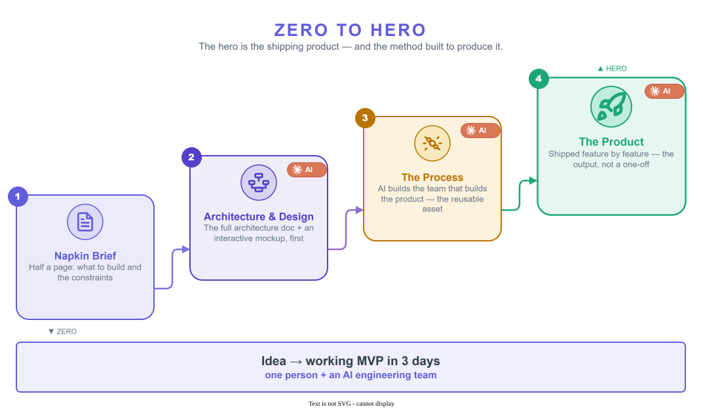
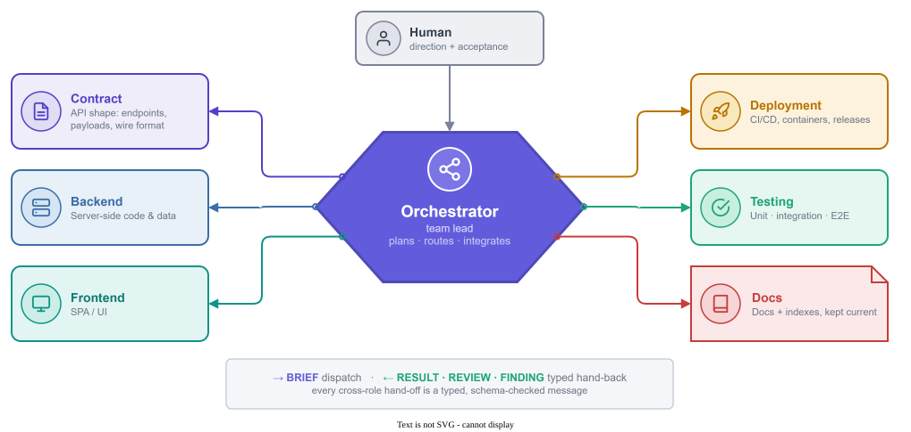
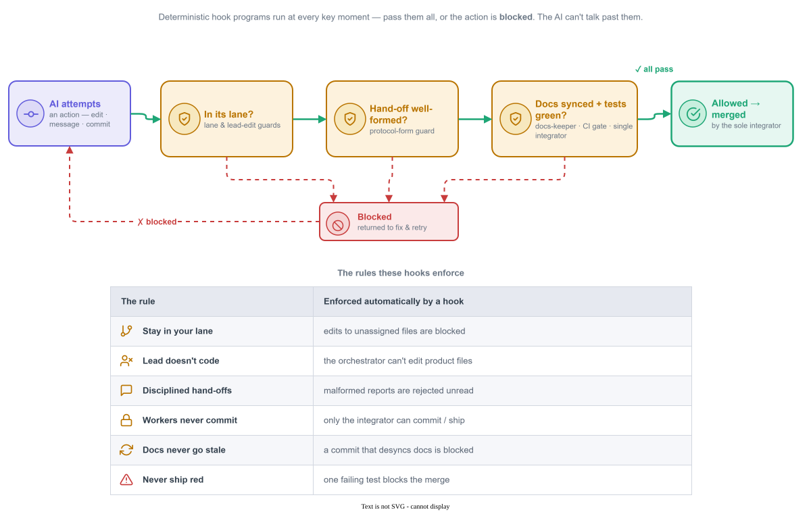
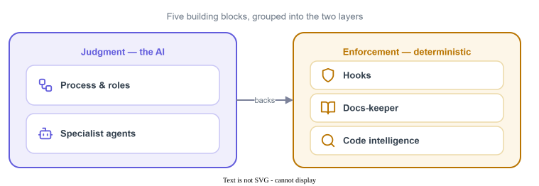
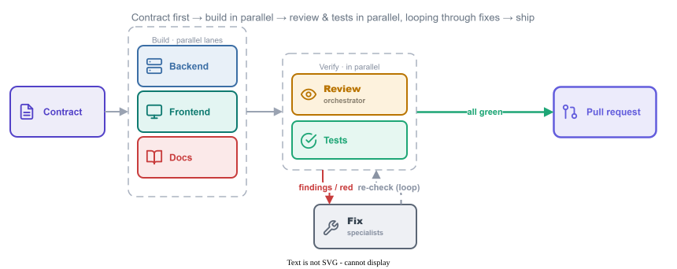

# :simple-claude: Built by Claude

<strong>Zero to hero:</strong> one person and an AI engineering team took a <strong>half-page brief</strong> to a shipping product — the <strong>Deployment Dashboard</strong> — a working <strong>MVP in 3 days</strong>.

[:octicons-arrow-right-24: How it was built](#zero-to-hero){ .md-button .md-button--primary }
[:fontawesome-brands-github: See the code](https://github.com/kostiantyn-matsebora/deployment-dashboard){ .md-button }

The goal

A complete product — the **Deployment Dashboard** — **produced by AI end-to-end**: code, automation, docs, tests, delivery. The human only **sets direction** and **signs off**.

{ .dd-shot }
{ .dd-shot }

## Two achievements in one project

-   :material-account-group:{ .lg .middle .dd-indigo } **A method — an AI engineering team**

    A reusable process: specialist roles, AI agents, and enforced guardrails. **The reusable asset.**

-   :material-package-variant-closed:{ .lg .middle .dd-emerald } **A product — built entirely by it**

    A real deployment dashboard, shipped end-to-end with one human steering. **The proof it works.**

## By the numbers

-   :material-rocket-launch:{ .lg .middle .dd-emerald } **MVP in 3 days**

    From napkin brief to a working product.

-   :material-account:{ .lg .middle .dd-indigo } **1 human + AI team**

    One person directing specialist AI agents.

-   :material-shield-check:{ .lg .middle .dd-amber } **~1,700 tests**

    Backend, frontend, contract, end-to-end.

-   :material-timer-outline:{ .lg .middle .dd-emerald } **~2.5 h / feature**

    A full DORA analytics view, contract to PR.

## The goal: a product *produced* by AI

Most "AI coding" stops at snippets a human must then integrate, test, document, and ship. Here, AI owns the **whole lifecycle** — the human stays minimal. The product here is real — the **Deployment Dashboard**, a live services × environments matrix sourced straight from CI/CD events.

-   :material-code-braces:{ .lg .middle .dd-indigo } **Source code**

    Backend services, web app, browser extension.

-   :material-cog-sync:{ .lg .middle .dd-indigo } **SDLC automation**

    Branching, guardrails, CI/CD, release machinery.

-   :material-book-open-variant:{ .lg .middle .dd-indigo } **Documentation**

    Architecture, specs, guides — kept current.

-   :material-test-tube:{ .lg .middle .dd-indigo } **Testing**

    Unit, contract, integration, end-to-end.

-   :material-rocket-launch-outline:{ .lg .middle .dd-indigo } **Delivery**

    Committed & reviewed as pull requests — then cut as GitHub Releases with deployable Docker images.

The human owns only **direction** and **acceptance**. Everything in between is the AI team's.

## Zero to hero

{ .dd-shot }

## How it works: judgment + enforcement

**Built the way Anthropic recommends building agents** — in the team's own terms:

- **Orchestrator-workers (hub & spoke)** — a lead plus specialist roles.
- **Isolated contexts** — each specialist works disposably; the lead stays lean.
- **Typed protocol** — every cross-role hand-off is a schema-checked message.
- **Deterministic guardrails** — the rules are enforced by programs, not goodwill.

Two layers carry it — **judgment** decides, **enforcement** guarantees:

=== "Layer 1 · Judgment"

    A **lead agent orchestrates** — it plans the work, routes each slice to the **role that owns it**, and integrates what comes back. One coordinator, many specialists.

    { .dd-shot }

    - **The lead coordinates, never codes** — it dispatches and integrates; it never edits a role's files.
    - **Roles own lanes** — each holds its own non-negotiable bar; parallel only on disjoint files.
    - **Typed hand-offs** — `BRIEF` down; `RESULT` · `REVIEW` · `FINDING` · `ARTIFACT` up; `FIX` for the loop.

=== "Layer 2 · Enforcement"

    Judgment can be argued with; **hooks can't** — small deterministic programs run at every key moment and **block** any rule-break. The AI can't talk past them.

    { .dd-shot }

    !!! tip "Ten such hooks"
        Each is an independently **tested** program, wired in at every key moment — session start, before each edit, before each message, before every commit.

## What the solution is made of

-   :material-sitemap:{ .lg .middle .dd-indigo } **Process & roles**

    A defined lifecycle — intake → contract → build → review → test → ship — run by an orchestrator + 6 specialist roles.

-   :material-robot-outline:{ .lg .middle .dd-indigo } **Specialist agents**

    AI workers for API, backend, frontend, deployment, testing, and documentation.

-   :material-book-sync:{ .lg .middle .dd-emerald } **Docs-keeper**

    Keeps documentation authoritative and current — and blocks any change that lets it drift.

-   :material-shield-lock:{ .lg .middle .dd-amber } **Hooks**

    10 deterministic guards that enforce the rules automatically, every time.

-   :material-magnify-scan:{ .lg .middle .dd-indigo } **Code intelligence**

    Purpose-built search so agents navigate the codebase fast and cheaply.

{ .dd-shot }

## The process in action: issue #299

**A DORA analytics view — contract to shipped — in ~2.5 hours.** A recent, ordinary example: a new analytics tab with the four industry-standard delivery metrics, eight charts, and new server-side endpoints.

{ .dd-shot }

- **~6,500 lines across 41 files** — API contract, backend, web UI, spec, and full test coverage.
- **Self-corrected** mid-flight through the review-and-fix loop.
- **Stopped at the pull request** for human acceptance — the process never auto-merges.

→ **See the real thing:** [issue #299 — the requirements](https://github.com/kostiantyn-matsebora/deployment-dashboard/issues/299) · [PR #308 — the implementation](https://github.com/kostiantyn-matsebora/deployment-dashboard/pull/308)

## Why it matters

-   :material-account-tie:{ .lg .middle .dd-indigo } **Team**

    One person directing an AI engineering team.

-   :material-rocket-launch:{ .lg .middle .dd-emerald } **Time to market**

    A working MVP in **3 days**; features in hours.

-   :material-check-decagram:{ .lg .middle .dd-amber } **Quality**

    Tests & review enforced by hooks — they *can't* be skipped.

-   :material-book-sync:{ .lg .middle .dd-emerald } **Living docs**

    Documentation can't silently rot.

-   :material-recycle-variant:{ .lg .middle .dd-indigo } **Reusability**

    The same process builds the *next* product too.

-   :material-account-supervisor-outline:{ .lg .middle .dd-indigo } **Control**

    Humans set direction; AI executes within guardrails.

The takeaway

One person and AI built a shipping product — a half-page idea became a working **MVP in 3 days**, plus a reusable engineering process that builds the next product too. The breakthrough isn't a smarter model — it's **instructions for judgment + hooks for guarantees**.

!!! quote ":simple-claude: Even this page"
    This showcase — every word and all five diagrams — was written and drawn by the same Claude team it describes. Meta, but true.
