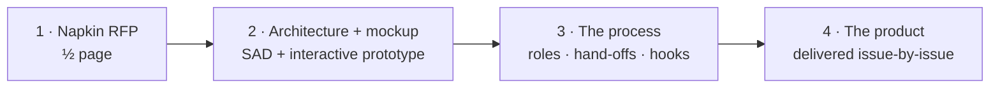
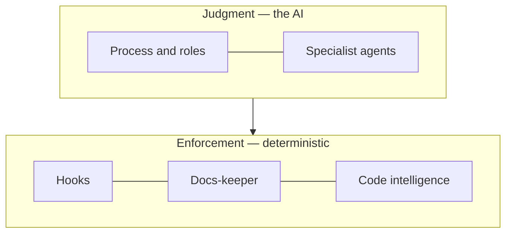
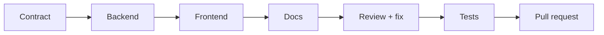

<div class="dd-hero" align="center" markdown>

# :simple-claude: Built by Claude

<p class="dd-tagline"><strong>Zero to hero:</strong> one person and an AI engineering team took a <strong>half-page brief</strong> to a shipping product — the <strong>Deployment Dashboard</strong> — a working <strong>MVP in 3 days</strong>.</p>

[:octicons-arrow-right-24: How it was built](#zero-to-hero){ .md-button .md-button--primary }
[:fontawesome-brands-github: See the code](https://github.com/kostiantyn-matsebora/deployment-dashboard){ .md-button }

</div>

<div class="dd-goal" markdown>

<span class="dd-goal-label">The goal</span>

A complete product — the **Deployment Dashboard** — **produced by AI end-to-end**: code, automation, docs, tests, delivery. The human only **sets direction** and **signs off**.

</div>

{ .dd-shot }
{ .dd-shot }

## Two achievements in one project

<div class="grid cards" markdown>

-   :material-account-group:{ .lg .middle .dd-indigo } **A method — an AI engineering team**

    A reusable process: specialist roles, AI agents, and enforced guardrails. **The reusable asset.**

-   :material-package-variant-closed:{ .lg .middle .dd-emerald } **A product — built entirely by it**

    A real deployment dashboard, shipped end-to-end with one human steering. **The proof it works.**

</div>

## By the numbers

<div class="grid cards" markdown>

-   :material-rocket-launch:{ .lg .middle .dd-emerald } **MVP in 3 days**

    From napkin brief to a working product.

-   :material-account:{ .lg .middle .dd-indigo } **1 human + AI team**

    One person directing specialist AI agents.

-   :material-shield-check:{ .lg .middle .dd-amber } **~1,700 tests**

    Backend, frontend, contract, end-to-end.

-   :material-timer-outline:{ .lg .middle .dd-emerald } **~2.5 h / feature**

    A full DORA analytics view, contract to PR.

</div>

## The goal: a product *produced* by AI

Most "AI coding" stops at snippets a human must then integrate, test, document, and ship. Here, AI owns the **whole lifecycle** — the human stays minimal. The product here is real — the **Deployment Dashboard**, a live services × environments matrix sourced straight from CI/CD events.

<div class="grid cards" markdown>

-   :material-code-braces:{ .lg .middle .dd-indigo } **Source code**

    Backend services, web app, browser extension.

-   :material-cog-sync:{ .lg .middle .dd-indigo } **SDLC automation**

    Branching, guardrails, CI/CD, release machinery.

-   :material-book-open-variant:{ .lg .middle .dd-indigo } **Documentation**

    Architecture, specs, guides — kept current.

-   :material-test-tube:{ .lg .middle .dd-indigo } **Testing**

    Unit, contract, integration, end-to-end.

-   :material-rocket-launch-outline:{ .lg .middle .dd-indigo } **Delivery**

    Committed & reviewed as pull requests — then cut as GitHub Releases with deployable Docker images.

</div>

The human owns only **direction** and **acceptance**. Everything in between is the AI team's.

## Zero to hero

**The hero is the shipping product — and the method built to produce it.** The arc: an idea on half a page → a tested, documented, shipping system.



1. **Napkin brief** — half a page: what it should do, and the constraints.
2. **Architecture & design** — AI wrote the full architecture document and an interactive mockup *first*.
3. **The process itself** — AI built the *team* that builds the product. **This framework is the reusable asset.**
4. **The product** — delivered feature by feature. **The output of the process, not a one-off.**

→ **Idea to working MVP: 3 days — built by one person and an AI team.**

## How it works: judgment + enforcement

Two layers — **instructions** for judgment, **hooks** for guarantees.

=== "Layer 1 · Judgment"

    An **orchestrator** breaks the work down and routes each piece to the specialist that owns it — like a senior human team.

    ```mermaid
    flowchart TB
        H[Human · goal + approval] --> O((Orchestrator))
        O --> C[Contract]
        O --> B[Backend]
        O --> F[Frontend]
        O --> D[Deployment]
        O --> T[Testing]
        O --> K[Docs]
    ```

=== "Layer 2 · Enforcement"

    Critical rules are enforced by **hooks** — deterministic programs that run automatically and **block** any rule-break. The AI can't talk past them.

    ```mermaid
    flowchart LR
        AI[AI attempts an action] --> G1{In its lane?}
        G1 -->|pass| G2{Report well-formed?}
        G2 -->|pass| G3{Docs synced + tests green?}
        G3 -->|pass| M[Allowed / Merged]
        G1 -->|block| AI
        G2 -->|block| AI
        G3 -->|block| AI
    ```

| The rule | Enforced automatically by a hook |
|---|---|
| **Stay in your lane** | edits to unassigned files are blocked |
| **Lead doesn't code** | the orchestrator can't edit product files |
| **Disciplined hand-offs** | malformed reports are rejected unread |
| **Workers never commit** | only the integrator can commit / ship |
| **Docs never go stale** | a commit that desyncs docs is blocked |
| **Never ship red** | one failing test blocks the merge |

!!! tip "Ten such hooks"
    Each is an independently **tested** program, wired in at every key moment — session start, before each edit, before each message, before every commit.

## What the solution is made of

<div class="grid cards" markdown>

-   :material-sitemap:{ .lg .middle .dd-indigo } **Process & roles**

    A defined lifecycle — intake → contract → build → review → test → ship — run by an orchestrator + 6 specialist roles.

-   :material-robot-outline:{ .lg .middle .dd-indigo } **Specialist agents**

    AI workers for API, backend, frontend, deployment, testing, and documentation.

-   :material-book-sync:{ .lg .middle .dd-emerald } **Docs-keeper**

    Keeps documentation authoritative and current — and blocks any change that lets it drift.

-   :material-shield-lock:{ .lg .middle .dd-amber } **Hooks**

    10 deterministic guards that enforce the rules automatically, every time.

-   :material-magnify-scan:{ .lg .middle .dd-indigo } **Code intelligence**

    Purpose-built search so agents navigate the codebase fast and cheaply.

</div>



## The process in action: issue #299

**A DORA analytics view — contract to shipped — in ~2.5 hours.** A recent, ordinary example: a new analytics tab with the four industry-standard delivery metrics, eight charts, and new server-side endpoints.



- **~6,500 lines across 41 files** — API contract, backend, web UI, spec, and full test coverage.
- **Self-corrected** mid-flight through the review-and-fix loop.
- **Stopped at the pull request** for human acceptance — the process never auto-merges.

→ **See the real thing:** [issue #299 — the requirements](https://github.com/kostiantyn-matsebora/deployment-dashboard/issues/299) · [PR #308 — the implementation](https://github.com/kostiantyn-matsebora/deployment-dashboard/pull/308)

## Why it matters

<div class="grid cards" markdown>

-   :material-account-tie:{ .lg .middle .dd-indigo } **Team**

    One person directing an AI engineering team.

-   :material-rocket-launch:{ .lg .middle .dd-emerald } **Time to market**

    A working MVP in **3 days**; features in hours.

-   :material-check-decagram:{ .lg .middle .dd-amber } **Quality**

    Tests & review enforced by hooks — they *can't* be skipped.

-   :material-book-sync:{ .lg .middle .dd-emerald } **Living docs**

    Documentation can't silently rot.

-   :material-recycle-variant:{ .lg .middle .dd-indigo } **Reusability**

    The same process builds the *next* product too.

-   :material-account-supervisor-outline:{ .lg .middle .dd-indigo } **Control**

    Humans set direction; AI executes within guardrails.

</div>

<div class="dd-goal" markdown>

<span class="dd-goal-label">The takeaway</span>

One person and AI built a shipping product — a half-page idea became a working **MVP in 3 days**, plus a reusable engineering process that builds the next product too. The breakthrough isn't a smarter model — it's **instructions for judgment + hooks for guarantees**.

</div>
