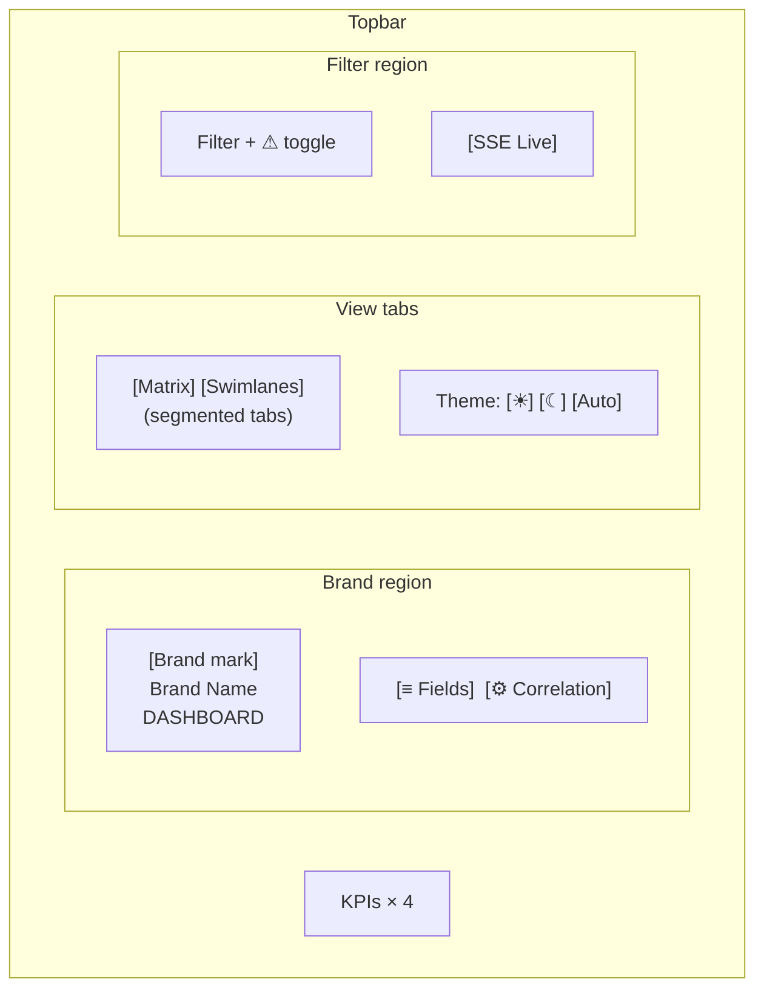
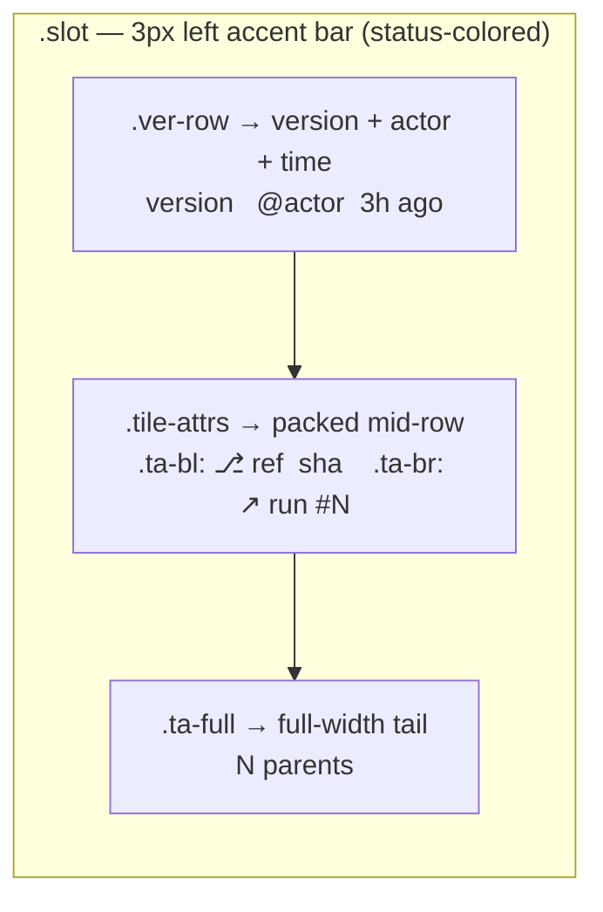
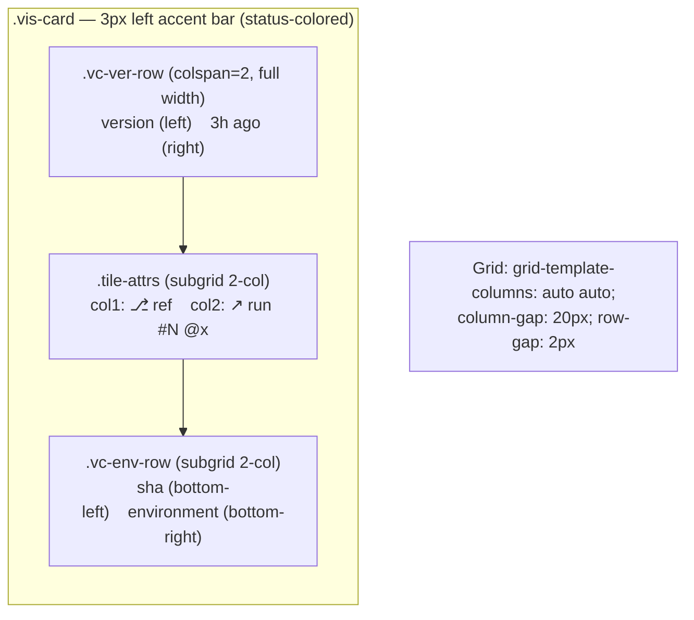

# Components

## Topbar

### Sub-components

| Element | PrimeNG Component | Behavior |
|---------|-------------------|----------|
| Brand mark | Custom | 32×32 radial-gradient square, `border-radius: 9px` |
| Segmented tabs | `p-selectButton` | Two options: Matrix / Swimlanes. Active = accent gradient + glow ring. Switches view. |
| KPI strip | Custom | 4 counters: services, environments, in-flight (`.is-warn`), failed (`.is-bad`). Derived from data. |
| Filter input | `pInputText` | Matrix-only, inline. Filters service rows by name (case-insensitive substring). |
| Failures toggle | `p-toggleSwitch` | Matrix-only, inline pill. `.is-on` = coral border + switch, hides non-failed rows. |
| Theme switch | `p-selectButton` | 3-state segmented: ☀ / ☾ / AUTO. Sets `data-theme` on `<html>`, persists to `localStorage`. |
| Icon buttons | Custom | Fields picker (▦) — shared. Correlation picker (⚙) — Swimlanes-only. Open popovers on click. |
| Live indicator | Custom | Green dot with `pulseRing` animation (1.8s). Shows SSE connection status. |

Topbar must be `position: relative; z-index: 30` so popovers render above sibling stacking contexts created by `backdrop-filter` on the matrix/vis shells.

---

## Matrix Tile

Each cell in the services × environments grid. Tile sizing is **content-driven** — grows/shrinks with toggled fields.

### Key Rules

- **Version:** single-line, `white-space: nowrap`, NO truncation, NO ellipsis. May be up to 50 chars. Column expands to fit.
- **Accent bar:** 3px left-edge `::before` pseudo. Color matches status.
- **Split tiles** (states S2–S4): two sections separated by `border-top: 1.5px dashed var(--divider-dash)`. Top = current state. Bottom = last-successful identifier.
- **Bottom-section identifier** uses fallback chain: `version` → `sha` → `ref` → `run_number`.
- **Empty slot:** muted "—" mark, reduced opacity background, no accent bar.
- **Minimum height:** ~56px (bare chrome). No fixed height — tile grows with content.

### Version Hover Highlight

Hovering any `.ver` span amber-highlights every tile across the matrix that shares the same version string. Effect: amber background + amber text + glow ring on `.ver.highlighted`, plus amber glow on `.slot.highlighted-slot`.

---

## 6 Box States

Every (service, environment) slot resolves to exactly one state based on deployment history. _(Ref: SAD §7 "6 box states")_

| Code | State Name | Condition | CSS Class |
|------|-----------|-----------|-----------|
| **S1** | Success | Last deployment succeeded | `.s-success` |
| **S2** | Running + Last Successful | Deploying now; prev terminal = success | `.s-run-last` |
| **S3** | Running + Failed + Last Successful | Deploying now; prev terminal = failure; older success exists | `.s-run-fail-last` |
| **S4** | Failed + Last Successful | Last deployment failed; older success exists | `.s-fail-last` |
| **S5** | Running (no prior) | Deploying now; no prior successful deployment | `.s-running-only` |
| **S6** | Running + Failed (no prior) | Deploying now; prev terminal = failure; no success history | `.s-run-fail-only` |

### Per-State Visual Specification

**S1 — Success:** Full green tile. Version headline + actor + elapsed time. All toggled field attributes render below. Background: emerald-wash gradient. Border: emerald-edge. Accent bar: emerald.

**S2 — Running + Last:** Split tile. Top: amber spinner + running version + meta. Bottom: last-successful identifier (fallback chain). Dashed divider between. Breathe animation (3.6s). Border: amber-edge. Accent bar: amber.

**S3 — Running + Failed + Last:** Split tile. Top: amber spinner + ⚠ "prev. failed" badge — NO running version text. Bottom: last-successful identifier. Dashed divider. Breathe animation. Badge: coral bg + coral border pill.

**S4 — Failed + Last:** Split tile. Top: red "FAILED" tag + failed version + meta. Bottom: last-successful identifier. Dashed divider. Background: coral-wash gradient. Border: coral-edge. Accent bar: coral.

**S5 — Running Only:** Full orange tile. Spinner + version (or "Running" label if version empty). No bottom section. Breathe animation. Border: amber-edge. Accent bar: amber.

**S6 — Running + Failed:** Full orange tile. Spinner + ⚠ badge — NO running version, NO bottom section. Breathe animation. Badge: coral bg + coral border pill.

### Spinner

14×14px circle, 2px border. `border-top-color: var(--amber)`, rest: `rgba(245,165,36, 0.18)`. `animation: spin 0.9s linear infinite`. Drop-shadow filter for glow.

### Warning Badge

Pill shape (999px radius). Coral bg at 15% + coral 45% border. "⚠ prev. failed" text — 10.5px uppercase 600-weight Inter.

---

## Swimlane Node Card

DAG nodes in the Swimlanes view. Each node is rendered via an ngx-graph `#nodeTemplate` custom template. Internal layout uses a **2-column CSS grid**.

### Key Differences from Matrix Tile

| Aspect | Matrix Tile | Swimlane Node |
|--------|------------|---------------|
| Primary identifier | `version` (headline, 11px 600) | `environment` (bottom-right, Inter 11px 600) |
| Version treatment | Headline (prominent) | Top-left (secondary, 10.5px 500, muted) |
| Internal layout | Flex column | 2-column CSS grid (subgrid rows) |
| Status states | 6-state machine (split tiles) | 3 simple states: `.s-success`, `.s-progress`, `.s-failure` |
| `parrent_deployments` | Shown as "⟵ N parents" text | **NOT rendered** — edges convey parents |
| Content overflow | Column expands horizontally | Rows scroll horizontally inside the card |
| Positioning | CSS grid cell (flow) | Managed by ngx-graph dagre layout (SVG `<g>` transform) |
| Selection | Click → history drawer | Click → Inspector panel + accent ring |

---

## History Drawer

Right-side slide-out panel showing per-slot deployment history. Opened by clicking any Matrix tile.

- **PrimeNG component:** `p-drawer` with `position="right"`, `[modal]="true"`, `[dismissible]="true"`, `[closeOnEscape]="true"`
- **Width:** 440px, right-aligned.
- **Overlay:** `--drawer-overlay` scrim covering viewport. Click to dismiss.
- **Header:** breadcrumb (`component · environment`), "history" title, close button (×).
- **Entries:** Timeline with colored pip (emerald/amber/coral). Each entry is a full-width card showing ALL 11 domain-model fields as explicit **label/value rows** — NOT mixed-treatment.
- **Rendered fields per entry:** version, status chip, ref, sha, run_number, actor, happened_at (elapsed + absolute UTC), parrent_deployments (list of truncated GUIDs), run_url link.
- **Close:** Escape key, overlay click, or × button.

---

## Inspector Panel

Persistent right sidebar in Swimlanes view. Updated when a node is selected.

- **Width:** 320px, part of the vis-shell grid.
- **Header:** breadcrumb (`component · environment`), status chip + version.
- **Body:** 2-column `.insp-grid` — ALL 11 domain-model fields as explicit **label/value** rows. `happened_at` shows elapsed + absolute UTC. `parrent_deployments` shows truncated GUIDs as accent-colored chips.
- Fields render regardless of attribute-picker state.

---

## Popovers

On-demand dropdown panels anchored to icon buttons. `z-index: 20` inside topbar's stacking context (`z-index: 30`).

**PrimeNG component:** `p-popover` with `[dismissable]="true"`, `appendTo="body"`.

### Fields Picker

- Shared between views; title and toggle list swap on view switch.
- **Matrix toggles (8):** `version`, `run_url`, `sha`, `run_number`, `ref`, `actor`, `happened_at`, `parrent_deployments`. Default: all ON.
- **Swimlanes toggles (8):** `environment`, `version`, `run_url`, `sha`, `run_number`, `ref`, `actor`, `happened_at`. `parrent_deployments` intentionally absent. Default: all ON.
- Layout: 2-column CSS grid of `p-checkbox` (`[binary]="true"`) labels.
- Toggle ON state: accent border + accent background tint + filled checkbox dot.

### Correlation Picker (Swimlanes only)

- 5 radio options (`p-radioButton`): `same sha`, `same run_number`, `same actor`, `same version`, `explicit parent`.
- Single-select — shared `ngModel`.
- Below: time-window `p-select` with options: 5 min, 1 hr, 1 day, 7 days.
- Time-window is **disabled** when `explicit parent` is selected.
