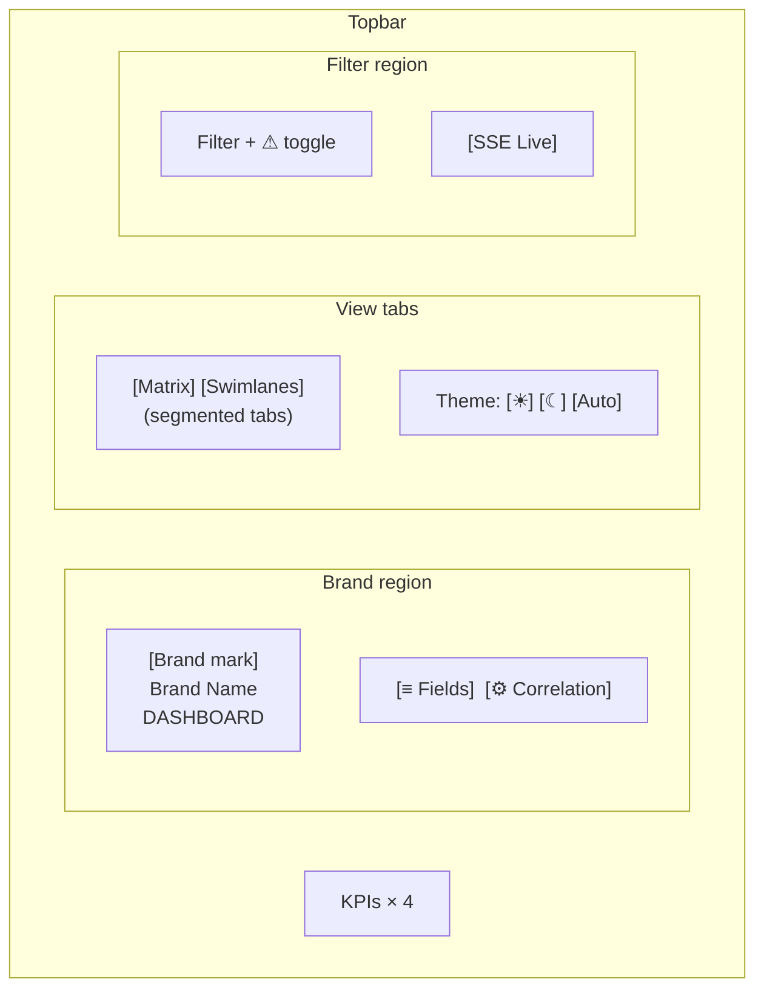
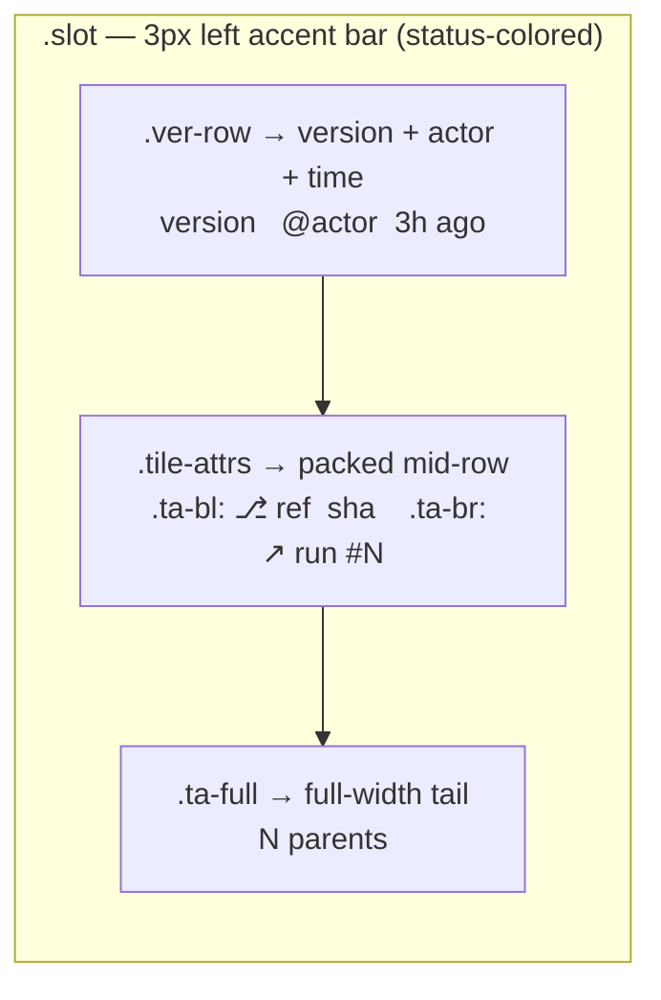
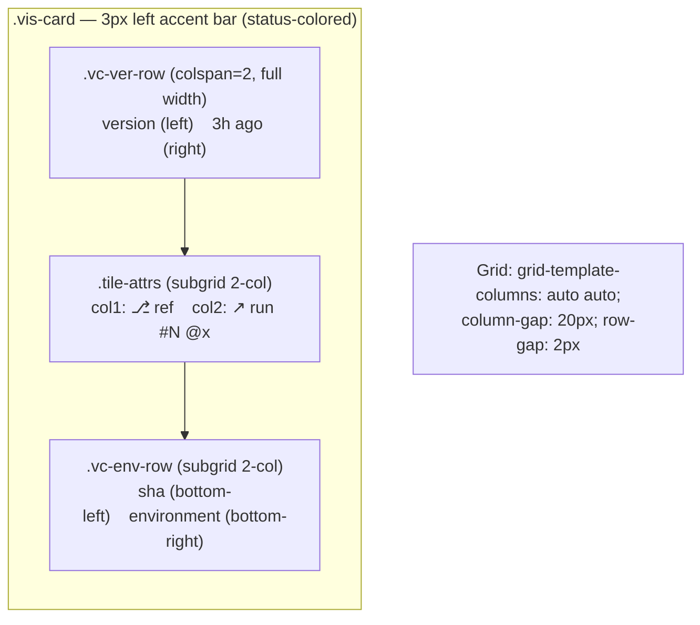

# Components

## Topbar

### Sub-components

| Element | PrimeNG Component | Behavior |
|---------|-------------------|----------|
| Brand mark | Custom | 32×32 radial-gradient square, `border-radius: 9px` |
| Segmented tabs | `p-selectButton` | Two options: Matrix / Swimlanes. Active = accent gradient + glow ring. Switches view. |
| KPI strip | Custom | 4 counters: services, environments, in-flight (`.is-warn`), failed (`.is-bad`). Derived from data. |
| Filter input | `pInputText` | Matrix-only, inline. Filters service rows by name (case-insensitive substring). |
| Failures toggle | `p-toggleSwitch` | Matrix-only, inline pill. `.is-on` = coral border + switch, hides non-failed rows. |
| Theme switch | `p-selectButton` | 3-state segmented: ☀ / ☾ / AUTO. Sets `data-theme` on `<html>`, persists to `localStorage`. |
| Icon buttons — Fields (▦) | Custom | Shared (Matrix + Swimlanes). Opens Fields picker popover. Shows accent state + hidden-count badge when any fields are OFF. Tooltip: `Fields — toggle visible data fields` (normal); `Fields — N field(s) hidden` when N > 0. |
| Icon buttons — Columns (⊞) | Custom | **Matrix-only** (hidden in Swimlanes). Opens Columns picker popover. Shows accent state + hidden-count badge when any environments are hidden. Tooltip: `Columns — show/hide environments` (normal); `Columns — N environment(s) hidden` when N > 0. |
| Icon buttons — Correlation (⇆) | Custom | **Swimlanes-only**. Opens Correlation picker popover. |
| Live indicator | Custom | Green dot with `pulseRing` animation (1.8s). Shows SSE connection status. |

**Tooltip consistency.** Every interactive topbar control carries a concise hover `title` tooltip: view tabs, service filter input, failures-only toggle, theme options, Fields button, Columns button, rate-limit chip, and the Live pill.

**Hidden-count badge.** Fields and Columns buttons share the same badge mechanism: when the hidden count N > 0, the button gains `.is-active` accent styling and a small filled count badge (`.hidden-count-badge`) positioned top-right on the icon. When N = 0, the badge is hidden and styling reverts to default.

Topbar must be `position: relative; z-index: 30` so popovers render above sibling stacking contexts created by `backdrop-filter` on the matrix/vis shells.

---

## Matrix Tile

Each cell in the services × environments grid. Tile sizing is **content-driven** — grows/shrinks with toggled fields.

### Key Rules

- **Version:** single-line, `white-space: nowrap`, NO truncation, NO ellipsis. May be up to 50 chars. Column expands to fit.
- **Accent bar:** 3px left-edge `::before` pseudo. Color matches status.
- **Split tiles** (states S2–S4): two sections separated by `border-top: 1.5px dashed var(--divider-dash)`. Top = current state. Bottom = last-successful identifier.
- **Bottom-section identifier** uses fallback chain: `version` → `sha` → `ref` → `run_number`.
- **Empty slot:** muted "—" mark, reduced opacity background, no accent bar.
- **Minimum height:** ~56px (bare chrome). No fixed height — tile grows with content.

### Version Hover Highlight

Hovering any `.ver` span amber-highlights every tile across the matrix that shares the same version string. Effect: amber background + amber text + glow ring on `.ver.highlighted`, plus amber glow on `.slot.highlighted-slot`.

---

## 6 Box States

Every (service, environment) slot resolves to exactly one state based on deployment history. _(Ref: SAD §7 "6 box states")_

| Code | State Name | Condition | CSS Class |
|------|-----------|-----------|-----------|
| **S1** | Success | Last deployment succeeded | `.s-success` |
| **S2** | Running + Last Successful | Deploying now; prev terminal = success | `.s-run-last` |
| **S3** | Running + Failed + Last Successful | Deploying now; prev terminal = failure; older success exists | `.s-run-fail-last` |
| **S4** | Failed + Last Successful | Last deployment failed; older success exists | `.s-fail-last` |
| **S5** | Running (no prior) | Deploying now; no prior successful deployment | `.s-running-only` |
| **S6** | Running + Failed (no prior) | Deploying now; prev terminal = failure; no success history | `.s-run-fail-only` |

### Per-State Visual Specification

**S1 — Success:** Full green tile. Version headline + actor + elapsed time. All toggled field attributes render below. Background: emerald-wash gradient. Border: emerald-edge. Accent bar: emerald.

**S2 — Running + Last:** Split tile. Top: amber spinner + running version + meta. Bottom: last-successful identifier (fallback chain). Dashed divider between. Breathe animation (3.6s). Border: amber-edge. Accent bar: amber.

**S3 — Running + Failed + Last:** Split tile. Top: amber spinner + ⚠ "prev. failed" badge — NO running version text. Bottom: last-successful identifier. Dashed divider. Breathe animation. Badge: coral bg + coral border pill.

**S4 — Failed + Last:** Split tile. Top: red "FAILED" tag + failed version + meta. Bottom: last-successful identifier. Dashed divider. Background: coral-wash gradient. Border: coral-edge. Accent bar: coral.

**S5 — Running Only:** Full orange tile. Spinner + version (or "Running" label if version empty). No bottom section. Breathe animation. Border: amber-edge. Accent bar: amber.

**S6 — Running + Failed:** Full orange tile. Spinner + ⚠ badge — NO running version, NO bottom section. Breathe animation. Badge: coral bg + coral border pill.

### Spinner

14×14px circle, 2px border. `border-top-color: var(--amber)`, rest: `rgba(245,165,36, 0.18)`. `animation: spin 0.9s linear infinite`. Drop-shadow filter for glow.

### Warning Badge

Pill shape (999px radius). Coral bg at 15% + coral 45% border. "⚠ prev. failed" text — 10.5px uppercase 600-weight Inter.

---

## Swimlane Node Card

DAG nodes in the Swimlanes view. Each node is rendered via an ngx-graph `#nodeTemplate` custom template. Internal layout uses a **2-column CSS grid**.

### Key Differences from Matrix Tile

| Aspect | Matrix Tile | Swimlane Node |
|--------|------------|---------------|
| Primary identifier | `version` (headline, 11px 600) | `environment` (bottom-right, Inter 11px 600) |
| Version treatment | Headline (prominent) | Top-left (secondary, 10.5px 500, muted) |
| Internal layout | Flex column | 2-column CSS grid (subgrid rows) |
| Status states | 6-state machine (split tiles) + `next` badge + never-deployed | same model — effective primary + `next` badge + never-deployed (see "Deployment statuses & context rendering"; NOT just 3 states) |
| `parrent_deployments` | Shown as "⟵ N parents" text | **NOT rendered** — edges convey parents |
| Content overflow | Column expands horizontally | Rows scroll horizontally inside the card |
| Positioning | CSS grid cell (flow) | Managed by ngx-graph dagre layout (SVG `<g>` transform) |
| Selection | Click → history drawer | Click → Inspector panel + accent ring |

---

## History Drawer

Right-side slide-out panel showing per-slot deployment history. Opened by clicking any Matrix tile.

- **PrimeNG component:** `p-drawer` with `position="right"`, `[modal]="true"`, `[dismissible]="true"`, `[closeOnEscape]="true"`
- **Width:** 440px, right-aligned.
- **Overlay:** `--drawer-overlay` scrim covering viewport. Click to dismiss.
- **Header:** breadcrumb (`component · environment`), "history" title, close button (×).
- **Entries:** Timeline with colored pip in the **status hue** (all 8 statuses, not only emerald/amber/coral — see "Deployment statuses & context rendering"). Each entry is a full-width card showing ALL 11 domain-model fields as explicit **label/value rows** — NOT mixed-treatment.
- **Rendered fields per entry:** version, status chip, ref, sha, run_number, actor, happened_at (elapsed + absolute UTC), parrent_deployments (list of truncated GUIDs), run_url link.
- **Close:** Escape key, overlay click, or × button.

---

## Inspector Panel

Persistent right sidebar in Swimlanes view. Updated when a node is selected.

- **Width:** 320px, part of the vis-shell grid.
- **Header:** breadcrumb (`component · environment`), status chip + version.
- **Body:** 2-column `.insp-grid` — ALL 11 domain-model fields as explicit **label/value** rows. `happened_at` shows elapsed + absolute UTC. `parrent_deployments` shows truncated GUIDs as accent-colored chips.
- Fields render regardless of attribute-picker state.
- **Next group (issue #268):** when `slot.next` is present, after the live fields a dotted separator then `next status` (chip) · `next version` · `next run_url`.

---

## Deployment statuses & context rendering (issue #268)

**Authoritative acceptance spec — every change to tiles / cards / history / inspector / legend MUST keep all of the below satisfied.** Source of truth for the 8-status model; do not regress.

### Status set (8)

| Status | Class | Group | Hue token | Icon |
|---|---|---|---|---|
| `success` | `s-success` | effective | `--emerald` | ✓ |
| `in-progress` | `s-progress` | effective | `--amber` | spinner |
| `failure` | `s-failure` | effective | `--coral` | ✕ |
| `pending` | `s-pending` | context (next) | `--slate` | ○ |
| `queued` | `s-queued` | context (next) | `--blue` | ≡ |
| `waiting` | `s-waiting` | context (next) | `--violet` | ◷ |
| `cancelled` | `s-cancelled` | context (next) | `--grey` | ⊘ |
| `rejected` | `s-rejected` | context (next) | `--rose` | ⊗ |

- **Effective** statuses describe the environment's deployment health → they DRIVE the tile/card colour (the 6 box states above).
- **Context** statuses are the *next* deployment (beyond the live one) → NEVER the tile colour; rendered as a badge/chip.

### `current` vs `next` (per slot)

- `current` = latest EFFECTIVE deployment → tile/card primary (box state + split-bottom).
- **Split-bottom (S2–S4)** shows the last-successful identifier via fallback `version → sha → ref → run_number` (the *previous* deployment). **Required on BOTH matrix tile and swimlane card.**
- `next` = latest CONTEXT deployment, present only when newer than `current` → secondary `.ctx-badge` on its own `.ctx-row`: icon + status word + version. Rendered on matrix tile AND swimlane card.

### Never-deployed slot (no effective baseline)

A slot whose only/latest deployment is a context status with NO prior effective deployment (e.g. first-ever gated/queued deploy). Read model: `current` is a context status, `next` absent.

- Render a **NEUTRAL / grey surface** (no health colour) + version + meta + a **status chip** carrying the actual context status (its hue + icon).
- DISTINCT from EMPTY ("—", zero deployment events → slot absent from the row).
- **History = exactly ONE entry** (the single deployment).
- Applies to matrix tile, swimlane card, and inspector.

### Surface parity

Matrix tile and swimlane card render the SAME state model: effective primary (6 box states) + `next` badge + never-deployed neutral. _(Supersedes the earlier "Swimlane = 3 simple states" note.)_

### History drawer

- All 8 statuses appear as distinct entries — pip + status chip in the **status hue** (not only emerald/amber/coral).
- The `next` deployment is the most-recent entry (leads the list).
- Never-deployed slot → single entry only.

### Legend (top-bar, per view)

Per-view content (matrix vs swimlanes), swapped on view change:
- **Status key** — "Environment state" (3 effective) + "Next deployment" (5 context): icon + swatch + meaning.
- **Field reference** — each visible field rendered AS IT APPEARS + its meaning (matrix `MATRIX_FIELDS` / swimlane `SWIMLANE_FIELDS`).
- **Matrix:** tile layouts (split / prev. failed / never-deployed / empty). **Swimlanes:** edges = parent→child + the correlation predicate.

---

## Popovers

On-demand dropdown panels anchored to icon buttons. `z-index: 20` inside topbar's stacking context (`z-index: 30`).

**PrimeNG component:** `p-popover` with `[dismissable]="true"`, `appendTo="body"`.

### Columns Picker (Matrix only)

**Matrix-only.** The `⊞` icon button opens this popover; the button and its wrapper `div` are hidden (`display: none`) when the Swimlanes view is active.

- **Toggle list:** one checkbox row per environment, ordered by the current column order. Checked = visible; unchecked = hidden.
- **Last-visible guard:** unchecking is blocked when exactly one environment is visible — the toggle click is a no-op, preventing a fully-empty grid.
- **Grid recompute:** hiding or showing an environment triggers an immediate matrix re-render — the grid recomputes from the visible, ordered environments. No placeholder columns; hidden columns are fully absent from the DOM.
- **"Show all · reset order" action:** a text-button at the bottom of the popover restores all environments to visible and resets the column order to the default environment order. Clears both `localStorage` keys.
- **Persistence:** hidden set persisted to `localStorage` key `dd:colHidden`. Restored on load.

### Fields Picker

- Shared between views; title and toggle list swap on view switch.
- **Matrix toggles (8):** `version`, `run_url`, `sha`, `run_number`, `ref`, `actor`, `happened_at`, `parrent_deployments`. Default: all ON.
- **Swimlanes toggles (8):** `environment`, `version`, `run_url`, `sha`, `run_number`, `ref`, `actor`, `happened_at`. `parrent_deployments` intentionally absent. Default: all ON.
- Layout: 2-column CSS grid of `p-checkbox` (`[binary]="true"`) labels.
- Toggle ON state: accent border + accent background tint + filled checkbox dot.

### Correlation Picker (Swimlanes only)

- 5 radio options (`p-radioButton`): `same sha`, `same run_number`, `same actor`, `same version`, `explicit parent`.
- Single-select — shared `ngModel`.
- Below: time-window `p-select` with options: 5 min, 1 hr, 1 day, 7 days.
- Time-window is **disabled** when `explicit parent` is selected.

---

## Extension Components

Components specific to the browser extension (issue #301). Reuse `status-chip` and `hist-link` tokens/classes from the SPA where noted.

### Toolbar Badge

The browser toolbar icon reflecting overall deployment health at a glance.

| State | Visual | Trigger |
|-------|--------|---------|
| Idle | Base product logo mark, no overlay | No in-flight or failed deployments (within watch scope) |
| In-flight | Amber badge overlay with count | ≥ 1 `in-progress` slot (status `in-progress` enabled in filter) |
| Failed | Coral badge overlay with count | ≥ 1 `failure` slot (status `failure` enabled in filter) |

- **Base icon:** product logo mark (same mark as SPA brand region).
- **Count:** per-(service×environment)-slot count; integer top-right; hidden when count = 0.
- **Priority:** failed state takes precedence over in-flight when both are non-zero.
- **Status filter gate:** disabling `failure` removes coral state; disabling `in-progress` removes amber.

---

### Notification Toast

Browser notification fired by the background SW on SSE events within watch scope.

- **Trigger:** any status transition where `(service, environment)` matches the watch filter AND the `status` is enabled in the status filter config.
- **Default:** all 8 statuses enabled → toast fires on every transition; narrow via the status filter.
- **Content:** service name · environment · version · status label.
- **Link:** entire toast links to the CI run URL (`run_url`); body includes "Open run #NNN" (`run_number`).
- **Accessibility (in-popup fallback display only):** if a future DOM-based toast fallback is added, `role="status"` (or `aria-live="polite"`) must sit on a non-interactive wrapper element — the `<a>` link must NOT be the live-region host. Does not apply to OS-level browser notifications, which are not DOM elements.

---

### Deployment List Popup Panel

Stateless panel opened by clicking the toolbar icon. Re-fetches `GET /api/deployments` on open and on storage change. Shows the last N events newest-first; N = `popupCount` (default 5).

**States:**

| State | Shown when |
|-------|-----------|
| Loading | Fetch in progress |
| Unconfigured | No `dashboardUrl` set |
| Paused | Master Watching switch is OFF |
| Empty | Fetch succeeded; no events match filters |
| List | ≥ 1 matching event |

**Per-row fields:**

| Field | Source field | Rendering |
|-------|-------------|-----------|
| Service | `service` | Plain text header |
| Environment | `environment` | Plain text |
| Version | `version` | Headline identifier |
| Status | `status` | `status-chip` (reuses SPA token/class) |
| Actor | `actor` | `@` prefix |
| Elapsed | `happened_at` | Relative elapsed ("3h ago") |
| Timestamp | `happened_at` | Absolute UTC below elapsed |
| Run link | `run_url` / `run_number` | `hist-link` styled "Open run #NNN" (reuses SPA class) |

- "Open dashboard" link shown whenever a `dashboardUrl` is configured (footer of panel).
- Filtered by service+environment watch filter and the status filter.

---

### Extension Config

Extension settings panel (options page or popup settings section).

#### Master Watching Switch

A prominent enable/pause toggle that gates all extension activity.

- **ON (Watching):** SSE connection active; badge updates; notifications fire.
- **OFF (Paused):** SSE connection closed; badge cleared; no notifications; filter controls visually dimmed.
- Persisted to extension storage.

#### Include/Exclude Watch Filter

Scoped filters controlling which services and environments generate badge updates and notifications.

| Control | Description |
|---------|-------------|
| Mode segmented control | Two options: **"Watch all except"** / **"Watch only"** |
| Services list | Checkbox list of known services; selection is the exclusion or inclusion set per mode |
| Environments list | Checkbox list of known environments; same include/exclude semantics |

- **"Watch all except"** (default): all services/environments watched; checked items excluded.
- **"Watch only"**: only checked items watched; unchecked items excluded.
- Filter controls are dimmed and non-interactive when the master Watching switch is OFF.
- Persisted to extension storage.

#### Status Filter

Per-status enable/disable checkboxes controlling which statuses appear in the popup list, trigger notifications, and count toward the badge.

| Control | Description |
|---------|-------------|
| Status checkboxes (8) | One checkbox per status: `pending`, `queued`, `waiting`, `in-progress`, `success`, `failure`, `cancelled`, `rejected` |

- All 8 enabled by default.
- Disabling `failure` removes coral badge state; disabling `in-progress` removes amber.
- Dimmed and non-interactive when the master Watching switch is OFF.
- Persisted to `storage.sync` as `statuses[]`.

#### Popup Count

Integer control setting the number of events shown in the deployment list popup.

- Label: "Show last N events".
- Range: 1–50; default 5.
- Persisted to `storage.sync` as `popupCount`.
