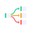

# Logo & Brand Mark

**Version:** 1.0
**Status:** Approved
**Date:** May 2026

## Concept

The mark is the product's **swimlanes view** distilled to its essence: a single **source deployment** (green node) fanning out through smooth, status-colored DAG edges to three **child deployments** — **green** (success), **amber** (in-progress), and **coral** (failure). It reads as "one deploy, many environment outcomes" — exactly what the dashboard makes visible.

Edges follow real **dagre / ngx-graph** routing: they leave the source card's right edge at *distributed* points (not a single origin), travel out horizontally, make their vertical transition mid-span, and enter each target horizontally with an arrow marker — the same curve treatment used by the live Swimlanes graph (`#linkTemplate`).

## Assets

All files live in `docs/design/logo/`.

| File | Use |
|------|-----|
| `logo.svg` | **Primary mark.** 64×64 glass tile (indigo gradient + sheen). App icon, topbar, anywhere on dark. |
| `logo-flat.svg` | Flat solid-indigo (`#1d1a55`) tile, white shapes. Small sizes & monochrome contexts. |
| `logo-mark-transparent.svg` | Graph only, no tile background. Place on any surface (light docs headers, etc.). |
| `logo-lockup.svg` | Horizontal lockup: mark + "Deployment Dashboard" wordmark + "CI / CD OBSERVABILITY" sub. Docs banner / topbar. |
| `favicon-16.png` | 16×16 favicon (uses the flat mark for legibility). |
| `favicon-32.png` | 32×32 favicon. |
| `favicon-48.png` | 48×48 favicon. |
| `apple-touch-icon.png` | 180×180 iOS home-screen icon. |
| `logo-512.png` | 512×512 raster — PWA manifest, social cards, README. |

## Color

Pulled directly from the design tokens — no new colors.

| Role | Token | Dark hex |
|------|-------|---------|
| Tile gradient | — | `#2a2770` → `#1b1850` → `#121038` |
| Tile (flat) | — | `#1d1a55` |
| Source node accent | `--emerald` | `#34d29a` |
| Child: success | `--emerald` | `#34d29a` |
| Child: in-progress | `--amber` | `#f5a524` |
| Child: failure | `--coral` | `#ff5d5d` |
| Node card fill | — | `rgba(180,175,255,0.15)` |
| Node / edge stroke | `--glass-edge-2` | `rgba(255,255,255,0.22)` |

The three status colors are load-bearing — they tie the mark to the matrix tiles, swimlane nodes, and edge colors used throughout the app. Do not recolor them.

## Geometry

- **Canvas:** 64×64, `viewBox="0 0 64 64"`. Tile is a 62×62 rounded rect, `rx=14`.
- **Nodes:** 13×10 rounded cards (`rx=2.8`), each with a 2.8px status accent bar on the left edge (`rx=1.3`) — the same accent-bar atom as the matrix tile and swimlane node.
- **Source:** at `(10, 27)`, green accent. **Children:** at `x=42`, `y=13 / 27 / 41`.
- **Edges:** exit the source's right edge at `y = 29.4 / 32 / 34.6` (distributed), 1.8px stroke, smooth cubic with horizontal tangents, arrowhead at each target.

## Clear space & minimum size

- **Clear space:** keep padding ≥ 25% of the mark's height on all sides. The tile has internal breathing room — don't crowd the outer edge.
- **Minimum size — mark:** 16px floor. Below 24px use `favicon-16.png` / `logo-flat.svg` — the glass gradient muddies at tiny sizes.
- **Minimum size — lockup:** don't render below 120px wide; below that, use the mark alone.

## Do / Don't

- **Do** use `logo.svg` on dark surfaces and `logo-mark-transparent.svg` on light docs surfaces.
- **Do** keep the green→(green/amber/coral) status mapping.
- **Don't** recolor the status nodes, rotate the mark, add drop shadows beyond the built-in glass treatment, or stretch the aspect ratio.
- **Don't** place the glass tile on a busy photographic background — use the flat or transparent variant instead.

## Integration

### Favicons (`index.html` `<head>`)

```html
<link rel="icon" type="image/png" sizes="32x32" href="assets/logo/favicon-32.png">
<link rel="icon" type="image/png" sizes="16x16" href="assets/logo/favicon-16.png">
<link rel="apple-touch-icon" sizes="180x180" href="assets/logo/apple-touch-icon.png">
<link rel="icon" type="image/svg+xml" href="assets/logo/logo.svg">
```

### Topbar brand mark (Angular)

Replace the placeholder `.brand-mark` in the topbar with the SVG mark. The lockup already matches the topbar's existing `.brand` structure (mark + name, 12px gap, right divider):

```html
<div class="brand">
  
  <div class="brand-text">
    <span class="brand-name">Deployment Dashboard</span>
    <span class="brand-sub">CI/CD Observability</span>
  </div>
</div>
```

```css
.brand-mark { border-radius: 9px; flex-shrink: 0; }
```

> The mark is a flat file — no extra glass CSS needed; the gradient, sheen, and edge are baked into the SVG.

### GitHub Pages docs header

Use `logo-lockup.svg` for the docs banner, or `logo-mark-transparent.svg` beside the page title. On the light Pages theme, prefer the transparent variant so the indigo tile doesn't fight the page background:

```html

```

### PWA manifest

```json
{
  "icons": [
    { "src": "assets/logo/logo-512.png", "sizes": "512x512", "type": "image/png" },
    { "src": "assets/logo/apple-touch-icon.png", "sizes": "180x180", "type": "image/png" }
  ]
}
```
