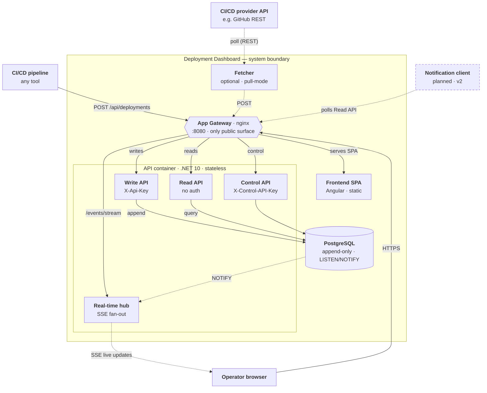

# Component diagram (C4)

A C4 component-level view of the runtime system (demo/eval components omitted). External systems sit outside the boundary; everything inside ships in the production stack. The gateway is the only published surface, and the API tier is a single stateless .NET container you can scale horizontally.

This Mermaid view is the lightweight, diff-friendly source. The [Architecture overview](../guide/architecture-overview.md#component-diagram-c4) embeds a polished draw.io rendering ([`architecture-c4.drawio`](./architecture-c4.drawio)) of the same system.

