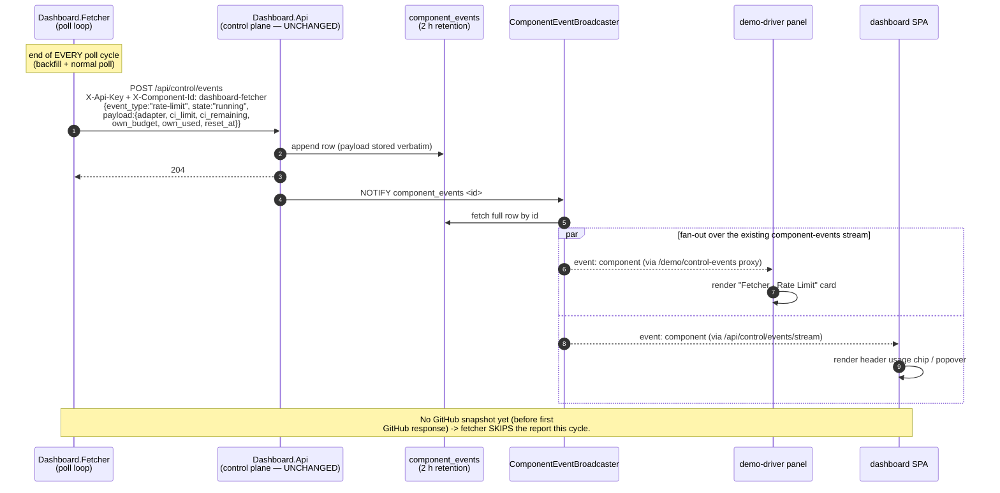
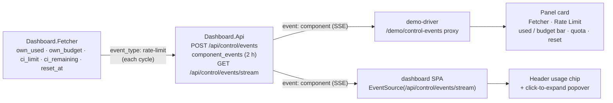

# Fetcher Rate-Limit Reporting — Per-Cycle Usage & Limits

> **Visual reference; authoritative behaviour lives in the specs linked below.** Diagrams for the "fetcher reports CI/CD usage & limits each cycle" feature. Authoritative behaviour lives in [`FETCHER_SPECIFICATION.md`](../FETCHER_SPECIFICATION.md) (decision + section), [`api/api-guidelines.md`](../api/api-guidelines.md) (component-event reporting + rate-limit payload), [`FRONTEND_REQUIREMENTS.md`](../FRONTEND_REQUIREMENTS.md), and [`DEMO_DRIVER_SPECIFICATION.md`](../DEMO_DRIVER_SPECIFICATION.md). No backend (`Dashboard.Api`) change — the transport already exists.

The defining constraint: the fetcher already **tracks** all the numbers (F16 / §5.9 / §6.1) and already **posts** component events (F17). This feature adds (a) a per-cycle emit, (b) two read surfaces. The control-plane transport — `POST /api/control/events`, the `component_events` table, the `ComponentEventBroadcaster`, and the `GET /api/control/events/stream` SSE — is **reused unchanged**.

---

## Diagram A — Emit and fan-out sequence

---

## Diagram B — Consumer topology

Two independent read surfaces consume the **same** `rate-limit` events off the one stream.

---

## Payload — `event_type: "rate-limit"`

Posted to the existing `POST /api/control/events` (auth `X-Api-Key` + `X-Component-Id: dashboard-fetcher`). `payload` is opaque jsonb to the API; the shape below is the contract the two UIs depend on (authoritative field table in [`api/api-guidelines.md`](../api/api-guidelines.md)).

| Field | Source (fetcher already reads it) | The task's three asks |
|---|---|---|
| `adapter` | `ICiCdAdapter.AdapterId` (e.g. `github-actions`) | — |
| `ci_limit` | GitHub `X-RateLimit-Limit` / `GITHUB_RATE_LIMIT` | **CI/CD API limit** |
| `ci_remaining` | GitHub `X-RateLimit-Remaining` (all token consumers) | CI/CD API usage (remaining) |
| `own_budget` | `floor(ci_limit × RateLimitBudgetPct/100)` (F16) | **own limit** |
| `own_used` | fetcher's own request counter this window (F16) | **own usage of CI/CD API** |
| `reset_at` | GitHub `X-RateLimit-Reset` (RFC 3339 UTC) | window rollover |

- `state: "running"` normally; `"paused"` when paused for reset (§5.10.3).
- All five numeric/time fields are **null before the first GitHub response**; the fetcher skips the emit until a snapshot exists (no all-null reports).

---

## Decisions (locked)

| # | Decision | Rationale |
|---|---|---|
| 1 | **Reuse the existing control-plane transport; zero `Dashboard.Api` change.** | Payload is already opaque jsonb; the stream + broadcaster already fan out component events. |
| 2 | **New `event_type: "rate-limit"`** (not overloaded onto `status`). | Clean filter on both UIs; additive to the open `event_type` vocabulary. |
| 3 | **Emit after every cycle (backfill + normal), gated on having a GitHub snapshot.** | Matches "after each cycle"; avoids meaningless all-null reports. |
| 4 | **Both surfaces** — demo-driver panel card + main-SPA header chip. | Operator (demo) and end-user (SPA) both see usage/limits. |
| 5 | **OpenAPI stays behaviour-only** — the payload shape is documented in `api-guidelines.md`, not `openapi.yaml` (payload remains `additionalProperties` opaque). | Project rule: openapi = observable behaviour; payload mechanics live in guidelines. |
