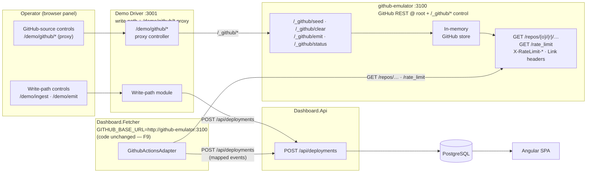
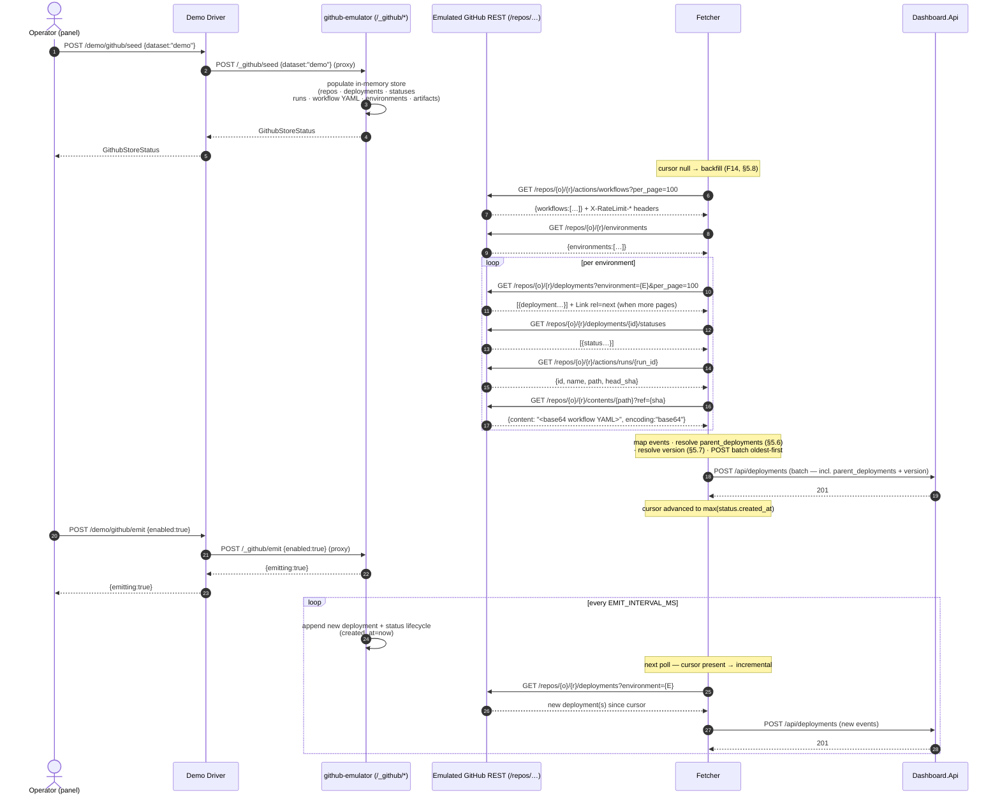

# GitHub API Emulation — Fetcher Demo Emulation

Visual reference only. Authoritative behaviour stays in [`DEMO_DRIVER_SPECIFICATION.md`](../DEMO_DRIVER_SPECIFICATION.md) §5, [`GITHUB_EMULATOR_SPECIFICATION.md`](../GITHUB_EMULATOR_SPECIFICATION.md), and [`FETCHER_SPECIFICATION.md`](../FETCHER_SPECIFICATION.md) §5. Wire shapes are in [`openapi.yaml`](../api/openapi.yaml) (dashboard API) and the fetcher spec's endpoint tables (GitHub surface).

---

## Diagram A — Demo-mode topology

Three services; two parallel write paths into `Dashboard.Api`.

**Key constraint.** The fetcher code is unchanged; `GITHUB_BASE_URL=http://github-emulator:3100` points its root-relative paths at the emulator. The driver proxy (`/demo/github/*`) exists solely for browser same-origin reachability — not an auth boundary.

---

## Diagram B — Seed → backfill → poll sequence

---

## Decisions (locked)

| # | Decision |
|---|---|
| G1 | GitHub emulation lives in a **separate `github-emulator` service** (`demo/github-emulator/`) — not in the driver. Per-adapter isolation: future ADO/Jenkins emulators are sibling services, each at their own root, with no path-prefix or port collision and no fetcher change required. |
| G2 | No fetcher code change — fetcher is config-driven (FETCHER_SPEC F9); demo mode sets `GITHUB_BASE_URL=http://github-emulator:3100`. The fetcher-host is wired into the demo compose profile (currently absent from all compose files). |
| G3 | Demo set = curated `demo/data/github/` fixture (workflow YAML + dev→staging→prod `needs` chain + artifact-sourced version), coherent with existing demo service/env names. Proves `parent_deployments` (F10) + artifact version (F15). |
| G4 | Random set / periodic emit = GitHub-shaped generator in the emulator, parallel to the write-path `random-event-generator.ts`. |
| G5 | Emulated REST emits `X-RateLimit-*` headers + `Link` pagination + serves `/rate_limit`; ETag/`304` deferred. Exercises the fetcher's F8/F16 paths. |
| G6 | The emulator IS the test mock for fetcher integration coverage — tests seed it via `POST /_github/seed` then assert the fetcher's output (realizes FETCHER_SPEC §7.2). |
