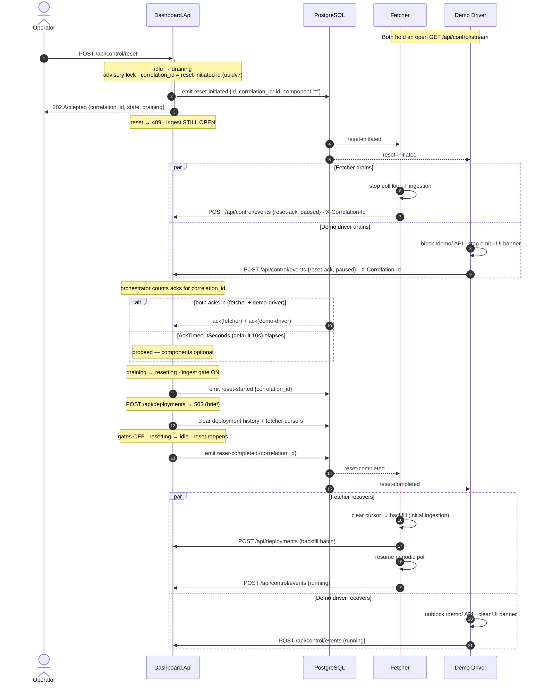
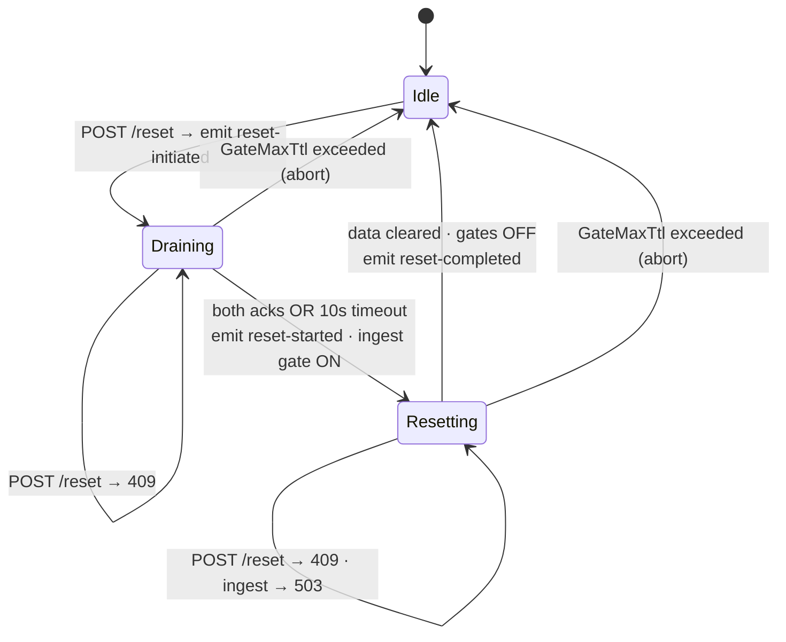

# Reset Choreography

Choreography-driven, event-based system-state reset across `Dashboard.Api` and its optional components (fetcher, demo-driver). The API is the orchestrator and single source of truth; components react to control-stream events and report back via `POST /api/control/events`.

**Authoritative behaviour:** [`API_SPECIFICATION.md` §10](../API_SPECIFICATION.md#10-implementation-phases-atomic-commits). This document is the visual reference only — wire shapes live in [`openapi.yaml`](../api/openapi.yaml).

## Control-stream event vocabulary

| `type` | Emitted when | `component` | Effect on components |
|---|---|---|---|
| `reset-initiated` | `POST /api/control/reset` accepted | `*` | Drain: stop fetching/ingesting, block own API + UI, then ack `paused`. |
| `reset-started` | Acks in OR timeout elapsed | `*` | Reset window opened; ingest briefly returns `503`. |
| `reset-completed` | Data cleared, gates released | `*` | Recover: clear state, re-ingest/backfill, unblock, report `running`. |

**`correlation_id` — the universal process id (#265).** It originates at `reset-initiated` (where `correlation_id == id`) and is carried by every downstream command frame (`reset-started` / `reset-completed`) and component event (`reset-ack`, post-reset `status`), so the whole saga shares one filterable key. Each event keeps its own unique `id` (PK / SSE cursor), **distinct** from `correlation_id`; there is no `reset_id` field.

Acks are `POST /api/control/events` with `event_type: reset-ack`, `state: paused`, and the **required** header `X-Correlation-Id: <reset-initiated id>`. The orchestrator gates on `correlation_id` (the stored header value, matched against the in-flight cycle). A reset-ack with a missing/mismatched `correlation_id` is recorded but does not count toward the gate (see [`API_SPECIFICATION.md` §7 Channel 3](../API_SPECIFICATION.md#channel-3--component_acks-reset-ack-fan-in)).

## Sequence

## State machine (API-driven)

Implemented with the **Stateless** library (`dotnet-state-machine/stateless`); current state is externally persisted in a DB state row (loaded per transition), with a Postgres advisory lock electing a single driver across instances (NFR-05). A `GateMaxTtl` safety abort prevents the system wedging with ingestion blocked if the driving instance dies mid-cycle.

## Decisions (locked)

| # | Decision |
|---|---|
| 1 | State machine via the **Stateless** library; state externally persisted (DB state row) + Postgres advisory lock for single-driver election across instances (NFR-05). |
| 2 | Proceed when **both** acks (fetcher + demo-driver) are in **OR** `AckTimeoutSeconds` elapses; default **10 s**. |
| 3 | Reset clears **only** `deployment_events` + `fetcher_state`; control/component tables left to the 2 h retention job. |
| 4 | Event types `reset-initiated` / `reset-started` / `reset-completed`; the legacy `reset` type is dropped (no alias). |
| 5 | Ack = `POST /api/control/events` `{event_type: reset-ack, state: paused}` + **required** header `X-Correlation-Id` = the `reset-initiated` id. The ack-gate keys on `correlation_id` (#265, Option A — `reset_id` retired everywhere). A missing/mismatched `correlation_id` is recorded but does not count toward the gate. |
| 6 | No status endpoint — reset progress is observable via the control-stream events only. |

Config keys (appsettings + env override): `AckTimeoutSeconds` (default 10), `ExpectedComponents` (default `dashboard-fetcher`, `demo-driver`), `GateMaxTtlSeconds` (default 60).

**`GateMaxTtlSeconds` enforcement.** This is a hard wall-clock ceiling on the entire orchestrator cycle, not just a checkpoint. A linked `CancellationTokenSource` armed with `GateMaxTtlSeconds` is created when the cycle starts and passed to every await inside the cycle — including `ClearDataTablesAsync`. If the ceiling fires (timeout, not graceful shutdown), the cycle is force-aborted: state written to `idle`, a `reset-completed` event emitted on the control stream so connected components recover, and the advisory lock released. The ack-wait (`AckTimeoutSeconds`) is a separate, inner timeout and is unaffected.
