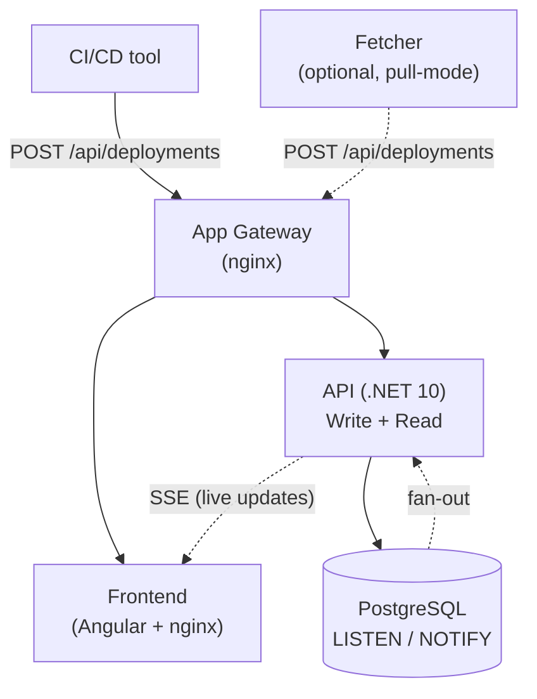
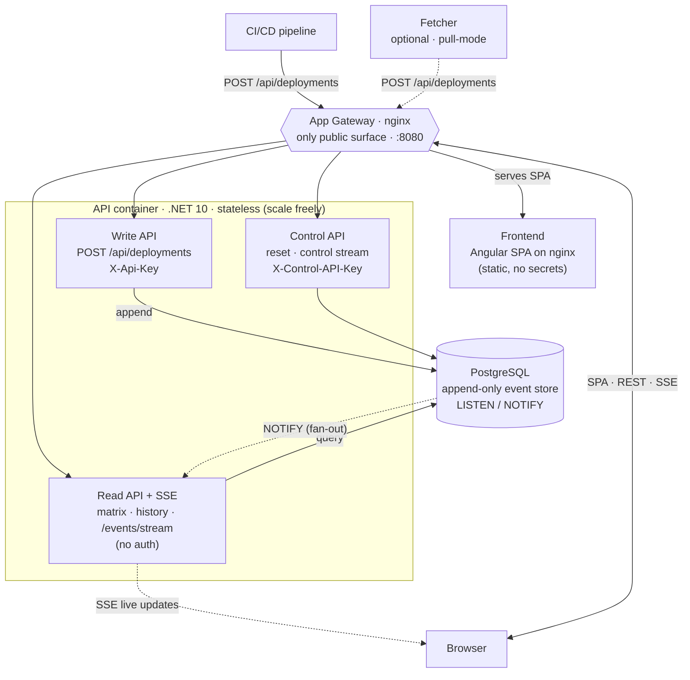

# Architecture overview

A high-level map for adopters and operators. For the full specification, see the [Solution Architecture Document](../SAD.md) and the per-component specs in [Development & reference](../index.md).

## The question it answers

> *What version of service X is running in environment Y right now — and did the last deployment succeed?*

Deployment Dashboard is a **read-only** view of deployment state, fed by CI/CD pipeline events. It does **not** trigger or manage deployments.

## Data flow

The Fetcher is an **optional** pull-mode adapter: it polls a CI/CD API and posts events through the same `POST /api/deployments` endpoint as any other pusher.

1. A pipeline (or the Fetcher) posts a deployment event to the gateway.
2. The **Write API** validates and **appends** it to PostgreSQL (append-only log).
3. PostgreSQL `NOTIFY` fans the event out to every API instance over `LISTEN/NOTIFY`.
4. Each instance pushes it to its connected browsers via **SSE** — no reload, no sticky sessions.
5. The **Read API** reduces the log into the matrix (latest per slot), swimlanes, and history.

## Component diagram

How the logical components fit together. All external traffic enters through the gateway — the only published surface; the API tier is a single stateless .NET container you can scale horizontally.

## Components

| Component | Stack | Role |
|---|---|---|
| App Gateway | nginx | Only published port (`:8080`). Routes to frontend + API; handles SSE buffering. |
| Frontend | Angular 20, served by nginx | The SPA. Static files, no runtime build. Holds no secrets. |
| API (Write + Read) | .NET 10 | Write = API-key-gated ingest; Read = unauthenticated matrix/history/SSE. Stateless. |
| Fetcher *(optional)* | .NET 10 | Pull-mode: polls a CI/CD API (GitHub Actions today) → posts via the push endpoint. |
| PostgreSQL | — | Event store + `LISTEN/NOTIFY` fan-out bus. |

The repo also ships demo-only components (Demo Driver, GitHub Emulator, Mock server) used for evaluation and testing — see [Development & reference](../index.md).

## Key design properties

| Property | What it means for you |
|---|---|
| **Tool-agnostic ingest** | Any CI/CD that can HTTP POST works. One step to integrate. See [Integrate your CI/CD](./send-events.md). |
| **Append-only** | Events are never mutated. Full history is retained (≥ 90 days, configurable). Retries = extra rows. |
| **Stateless backend** | Scale API instances freely behind the gateway; SSE still reaches every client. |
| **Auto-discovery** | Services and environments come from the data — no hardcoded lists, no registration. |
| **Internal-only by design** | Reads and the SSE stream are unauthenticated; only writes require a key. Deploy behind your network / TLS — never expose the Read API publicly. |

## Security model (short version)

| Surface | Auth |
|---|---|
| `POST /api/deployments`, fetcher state, component events | `X-Api-Key` |
| `POST /api/control/reset`, control stream | `X-Control-API-Key` (separate, optional) |
| Reads (`/api/matrix`, history, `/api/events/stream`) | none — internal network only |

See the [Security policy](https://github.com/kostiantyn-matsebora/deployment-dashboard/blob/main/SECURITY.md) and [API guidelines §10](../api/api-guidelines.md#10-security-notes).
