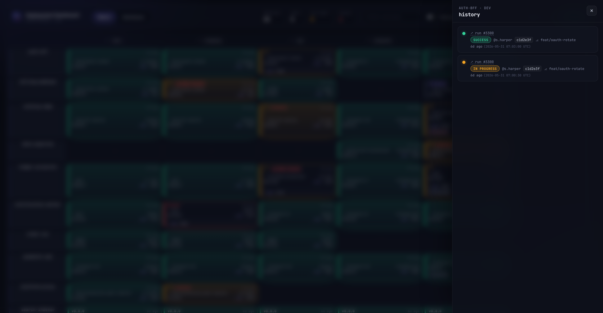
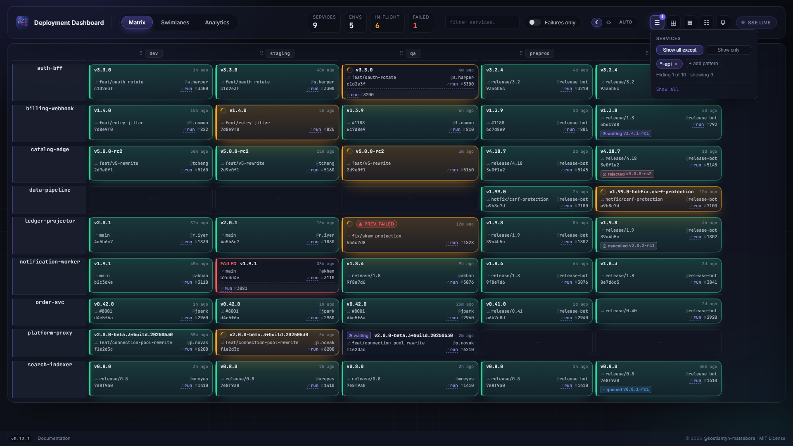
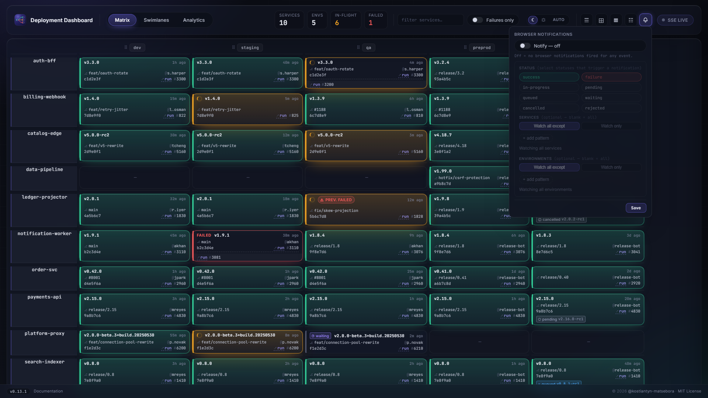
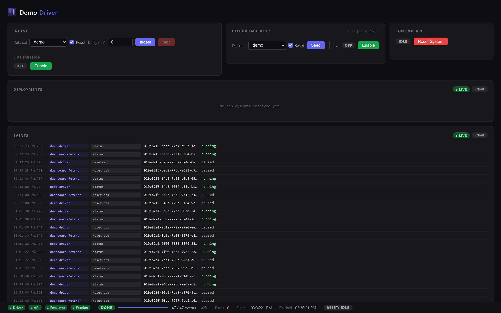
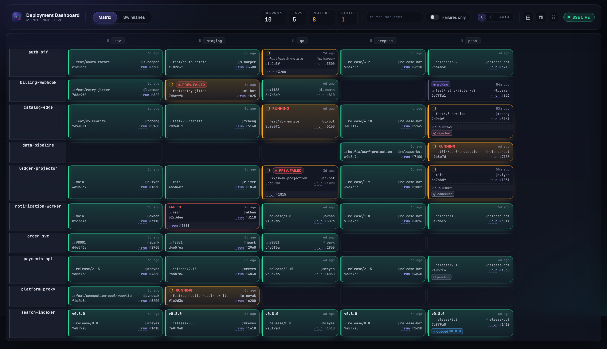
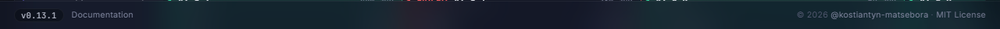

# Screenshots

A visual tour of the dashboard. Every image below is the **live demo stack** (`--profile demo`) seeded with the curated demo dataset — exactly what you get from the [Quickstart](./quickstart.md). Toggle the site's light/dark switch and the matrix and swimlane shots follow.

## :material-view-grid-outline: Deployment matrix { #deployment-matrix }

The default view: one row per service, one column per environment. Each tile carries version, status (success / in-progress / failure), actor, commit, elapsed time, and a link to the CI/CD run. KPIs across the top summarise services, environments, in-flight, and failed counts.

{ .dd-shot }
{ .dd-shot }

## :material-sitemap-outline: Swimlanes { #swimlanes }

A per-service graph view: see how a version flows from `dev` through `qa`, `staging`, `preprod`, and `prod`, with branching topology and status-colored edges.

{ .dd-shot }
{ .dd-shot }

## :material-format-list-bulleted: Deployment feed { #deployment-feed }

The chronological event log, grouped by `deployment_id` into expandable roll-ups (or flat, one row per event) via a shared toggle. Search the full history server-side, or scroll to load older pages via cursor pagination. A toggleable bottom dock mirrors the same log — last 8 events, live via SSE with a flash on arrival — on every other view; it's suppressed while the Feed view itself is active.

{ .dd-shot }
{ .dd-shot }

## :material-history: History drawer { #history-drawer }

Click any slot to open its full deployment history — every event ever recorded for that `(service, environment)`, newest first, with status, version, actor, commit, and run reference.

{ .dd-shot }

## :material-chart-line: Analytics { #analytics }

A DORA-anchored analytics view covering the last 7, 14, or 30 days (bounded by `HISTORY_RETENTION_DAYS`). The KPI band at the top surfaces the four DORA keys — deployment frequency, lead time (approximated from promotion chains), change failure rate, and mean time to restore — followed by eight charts: deployment frequency over time, change-failure-rate trend, deployment-duration distribution (p50/p95), promotion funnel, status distribution, deploy heatmap (day-of-week × hour), top deployers, and time-to-restore incidents.

{ .dd-shot }
{ .dd-shot }

## :material-filter-outline: Services filter { #services-filter }

Glob pattern filter for services: type a pattern (`front-*`, `checkout`, `org-a/gateway`, etc.), pick "Show only" or "Show all except", and the Matrix rows and Swimlanes lanes update instantly. Patterns persist across reloads.

**Namespace-aware matching.** Services fetched from different GitHub repositories (or posted with a non-null `namespace` field) can share the same workflow/service name. Each `(namespace, service)` pair is a distinct row. When a name collision exists, the row label shows the `namespace/` prefix; otherwise the bare name is shown. A pattern containing `/` matches the full `namespace/service` identity; a slashless pattern matches the service name across all namespaces — existing saved patterns keep working without change. Autocomplete offers both bare names and composite `namespace/service` identities derived from received data.

The same widget appears in the notification preferences popover for service and environment axes.

{ .dd-shot }

{ .dd-shot }

## :material-bell-outline: Browser notifications { #browser-notifications }

Opt-in desktop notifications triggered by deployment status transitions. Enable the bell toggle in the topbar — the browser permission is requested once, lazily. Filter notifications by status, service, and environment via the notification preferences popover.

{ .dd-shot }
{ .dd-shot }

## :material-bookmark-box-multiple-outline: UI settings presets { #ui-settings-presets }

Save, apply, share, and import named snapshots of your UI settings — filters, display preferences, and notification configuration — via the preset panel.

{ .dd-shot }
{ .dd-shot }

### Import from URL

The preset panel's **Import from URL** field lets you paste a public HTTPS link to a single preset or a multi-preset bundle. The SPA fetches client-side — no backend involved.

[:octicons-arrow-right-24: Import from URL — accepted formats and boundaries](./ui-settings.md#import-from-url)

## :material-tune-variant: Demo control panel { #demo-control-panel }

The demo profile ships a **Demo Driver** control panel (`/demo/`): ingest the curated or random dataset, seed the GitHub emulator, drive live emission, trigger a system reset, and watch the deployment feed and component event streams in real time.

{ .dd-shot }

## :material-application-outline: Install as an app { #install-as-an-app }

The dashboard can be installed as a standalone Chromium app — a dedicated window with no browser chrome, a taskbar or dock icon, and the same deployment URL behind your gateway.

{ .dd-shot }

[:octicons-arrow-right-24: Install guide](./install-app.md){ .md-button }

## :material-cloud-download-outline: Provided presets { #provided-presets }

Read-only, repo/CI-sourced UI-settings presets published by a `owner/repo` source — either directly over the [push-mode REST recipe](./provided-presets.md#publishing-presets-push-mode) or automatically discovered by the Fetcher in pull mode. They appear in a **PROVIDED** section of the topbar presets popover, alongside any presets saved locally, with **Apply** and **Clone-to-edit** actions. Nothing here is ever written back — provided presets are never edited or deleted from the UI.

{ .dd-shot }
{ .dd-shot }

[:octicons-arrow-right-24: Provided presets guide](./provided-presets.md){ .md-button }

## :material-dock-bottom: Footer { #footer }

A fixed glass footer persists across all views. The left side shows the running version (sourced from `GET /api/version`, prefixed `v`) and a **Documentation** link. The right side carries the copyright and MIT License attribution.

{ .dd-shot }

---

Want to see it for yourself? It's one command:

[:material-rocket-launch-outline: Try the Quickstart](./quickstart.md){ .md-button .md-button--primary }
