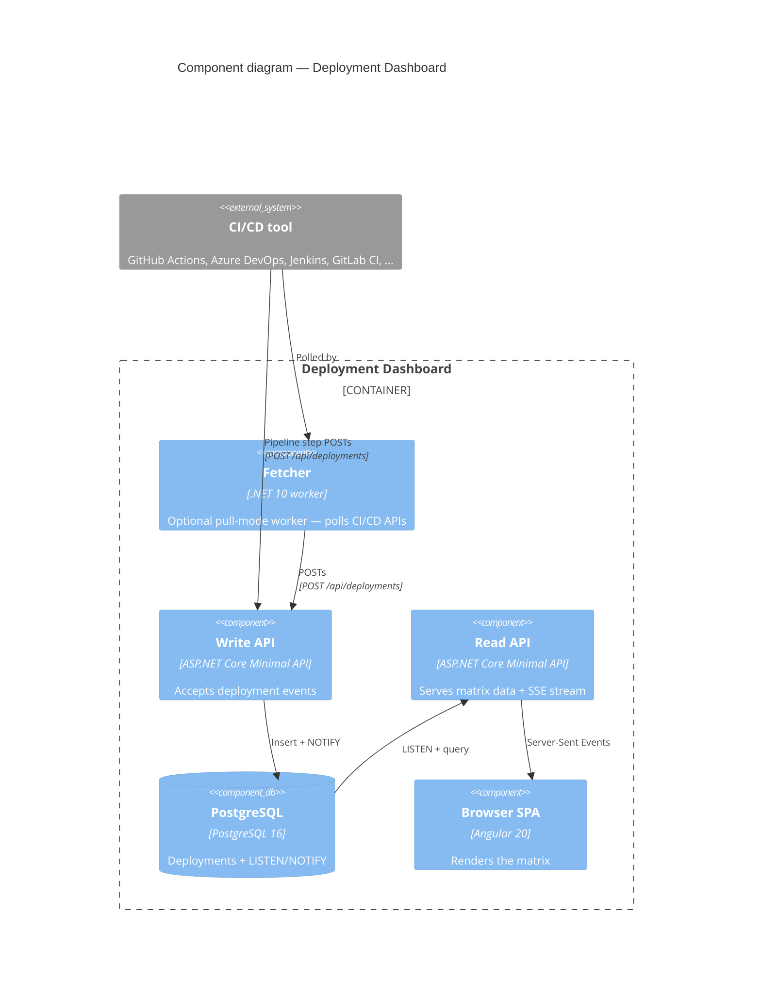

# Deployment Dashboard

Real-time **services x environments** deployment matrix sourced from any CI/CD tool that can POST an HTTP event (GitHub Actions, Azure DevOps, Jenkins, GitLab CI, ...). Built for engineers and teams running multi-service deployments who want a single glance answer to *"what version of service X is running in environment Y right now, and did the last deploy succeed?"* Tool-agnostic by design; read-only / notification-only — it tracks deployments, it never triggers them.

[Get started in 60 seconds](getting-started.html){: .btn .btn-primary .fs-5 .mb-4 .mb-md-0 .mr-2 }
[View on GitHub]({{ site.github.repository_url }}){: .btn .fs-5 .mb-4 .mb-md-0 }

## Quickstart

```powershell
# Windows
gh release download --repo kostiantyn-matsebora/deployment-dashboard --pattern install.ps1 --output install.ps1 --clobber
pwsh -NoProfile -File install.ps1 -Demo
# Open http://localhost:8080
```

```bash
# Linux / macOS
gh release download --repo kostiantyn-matsebora/deployment-dashboard --pattern install.sh --output install.sh --clobber
bash install.sh --demo
# Open http://localhost:8080
```

Full reference: [install.md](install.html).

## Features

- **Tool-agnostic** — any CI/CD tool that can POST HTTP.
- **Real-time** — SSE + Postgres `LISTEN/NOTIFY`, on screen in ≤ 5 s.
- **Read-only / notification-only** — never triggers deployments.
- **Six box states** — single-glance success / failure / in-flight / pending / unknown / stale.
- **Four views x three layouts** — Detailed / Compact / Glance / Focus across Matrix / Swim-lane / Workflow-rows.
- **Light / dark / auto theme.**
- **Optional pull-mode fetcher** — for tools without webhook support (GitHub Actions today, extensible).
- **Internal-only posture** — no public ingress, no RBAC, X-Api-Key on writes only.

Detail: [features.html](features.html).

## How it works



Full topology + decisions: [architecture.html](architecture.html).

## Documentation

[Get Started](getting-started.html) · [Install](install.html) · [Features](features.html) · [Architecture (SAD)](architecture.html) · [ADRs](adr/) · [CRs](cr/) · [UI Options](ui/) · [Work Breakdown](WBS.html) · [CI/CD Integration (inbound)](ci-cd-integration.html) · [CI/CD Pipelines (outbound)](ci-cd-pipelines.html)

## Built end-to-end by AI

Every commit, ADR, CR, test, and CI workflow in this repo was authored by AI specialists routed through [`ginee`](https://github.com/kostiantyn-matsebora/ginee) — a multi-agent engineering process for small autonomous teams.

> **Pre-1.0** — APIs, infra, and configuration may change. Suitable for evaluation, demos, and internal testbed use only.

## Governance

[LICENSE]({{ site.github.repository_url }}/blob/main/LICENSE) · [CONTRIBUTING]({{ site.github.repository_url }}/blob/main/CONTRIBUTING.md) · [CODE_OF_CONDUCT]({{ site.github.repository_url }}/blob/main/CODE_OF_CONDUCT.md) · [SECURITY]({{ site.github.repository_url }}/blob/main/SECURITY.md) · [CHANGELOG]({{ site.github.repository_url }}/blob/main/CHANGELOG.md)
