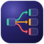

<div class="dd-hero" align="center" markdown>

{ width="104" }

# Deployment Dashboard

<p class="dd-tagline">A real-time <strong>services × environments</strong> deployment matrix, sourced straight from your CI/CD pipeline events.</p>

[:material-rocket-launch-outline: Get started](guide/quickstart.md){ .md-button .md-button--primary }
[:material-pipe: Integrate your CI/CD](guide/send-events.md){ .md-button }
[:fontawesome-brands-github: GitHub](https://github.com/kostiantyn-matsebora/deployment-dashboard){ .md-button }
[:simple-claude: Built by Claude — see how](built-by-ai/){ .md-button }

</div>

=== "Matrix"

    One row per service, one column per environment. Each tile shows version, status, actor, elapsed time, and a link to the CI/CD run.

    { .dd-shot }
    { .dd-shot }

=== "Swimlanes"

    Per-service deployment graphs — see how a version flows from `dev` through to `prod`, with branching topology and status-colored edges.

    { .dd-shot }
    { .dd-shot }

=== "Analytics"

    DORA Four Keys — deployment frequency, lead time, change failure rate, and MTTR — plus eight supporting charts to spot delivery trends and regressions over 7, 14, or 30 days.

    { .dd-shot }
    { .dd-shot }

!!! quote ""
    **The question it answers:** *What version of service X is running in environment Y right now — and did the last deployment succeed?*

## Why Deployment Dashboard?

<div class="grid cards" markdown>

-   :material-pipe-wrench:{ .lg .middle .dd-indigo } **No pipeline rewrite**

    ---

    Integration is a single HTTP `POST` step. No plugins, no agent to install, no migration — drop one step into the pipeline you already have.

-   :material-source-branch:{ .lg .middle .dd-indigo } **Tool-agnostic**

    ---

    GitHub Actions, Azure DevOps, Jenkins, GitLab CI — or a shell script. If it can call a URL, it can feed the dashboard. The backend never knows which tool you use.

-   :material-help-circle-outline:{ .lg .middle .dd-amber } **Answers one question, instantly**

    ---

    What's running in prod right now, and did it succeed? One screen — every service across every environment, no clicking through pipelines and logs.

-   :material-lightning-bolt:{ .lg .middle .dd-emerald } **Live, not polled**

    ---

    Server-Sent Events push every state change to every open browser within seconds. The matrix updates itself — no refresh, no stale tab.

-   :material-history:{ .lg .middle .dd-indigo } **Full history, append-only**

    ---

    Every deployment is kept per slot (≥ 90 days, configurable). Nothing is overwritten; the history drawer shows the entire timeline of a slot.

-   :material-auto-fix:{ .lg .middle .dd-amber } **Auto-discovers your topology**

    ---

    Services and environments are derived from the events you send. No registration, no config file, no hardcoded lists — post a new service and it appears.

-   :material-server-network:{ .lg .middle .dd-emerald } **Stateless & cheap to run**

    ---

    Scale API instances behind the gateway with no sticky sessions. Runs on any OCI container host; the reference Azure target fits in ~$30/month.

-   :material-shield-lock-outline:{ .lg .middle .dd-coral } **Secure by design**

    ---

    Writes are API-key gated; reads are internal-only and the SPA holds no secrets. You own the network boundary — nothing is public by default.

-   :material-cloud-download-outline:{ .lg .middle .dd-indigo } **Pull mode when you can't push**

    ---

    Can't touch the pipeline? The optional Fetcher polls your CI/CD API and posts on your behalf — through the very same contract.

    Pull mode also fits **locked-down networks that forbid inbound WAN traffic**: the Fetcher is **outbound-only** (it calls the GitHub API and the dashboard's internal ingest), so the dashboard never has to accept inbound connections from the internet — unlike push, where CI/CD must reach in to POST.

</div>

## Send your first deployment

One HTTP call from your pipeline — that's the whole integration:

```bash
curl -X POST "$DASHBOARD_URL/api/deployments" \
  -H "X-Api-Key: $DASHBOARD_API_KEY" \
  -H "Content-Type: application/json" \
  -d '{
    "deployment_id": "build-42",
    "service":       "checkout",
    "environment":   "prod",
    "version":       "1.4.2",
    "status":        "success",
    "happened_at":   "2026-06-01T10:00:00Z"
  }'
```

[:octicons-arrow-right-24: GitHub Actions, Azure DevOps, GitLab & Jenkins examples](guide/send-events.md)

## Architecture at a glance

A handful of containers behind one gateway: a stateless .NET API tier, PostgreSQL as the append-only source of truth, and an optional pull-mode Fetcher. The **gateway is the only public surface** — reads are internal-only and the SPA holds no secrets.

[{ .dd-shot .dd-diagram }](diagrams/architecture-c4.svg)
[{ .dd-shot .dd-diagram }](diagrams/architecture-c4-dark.svg)

[:octicons-arrow-right-24: Architecture overview & the security model](guide/architecture-overview.md)

## Explore the docs

<div class="grid cards" markdown>

-   :material-rocket-launch:{ .lg .middle } &nbsp; **[Quickstart](guide/quickstart.md)**

    Run the whole stack locally in two minutes, zero config.

-   :material-server-network:{ .lg .middle } &nbsp; **[Install & deploy](guide/install.md)**

    Compose profiles, production checklist, hosting notes.

-   :material-cog:{ .lg .middle } &nbsp; **[Configuration](guide/configuration.md)**

    Every environment variable, grouped by concern.

-   :material-sitemap:{ .lg .middle } &nbsp; **[Architecture](guide/architecture-overview.md)**

    How the pieces fit, and the security model.

-   :material-api:{ .lg .middle } &nbsp; **[API contract](api/index.md)**

    OpenAPI spec + human-readable guidelines.

-   :material-hammer-wrench:{ .lg .middle } &nbsp; **[Contributing](https://github.com/kostiantyn-matsebora/deployment-dashboard/blob/main/CONTRIBUTING.md)**

    Local setup, branch → PR workflow, conventions.

</div>

---

Looking for the full specification? The **Development & reference** tab covers the [architecture (SAD)](SAD.md), [API contract](api/index.md), [frontend design](design/index.md), services, and [diagrams](diagrams/index.md).
